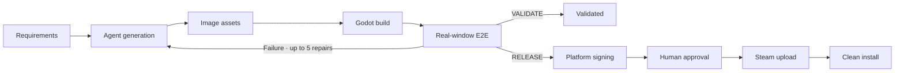
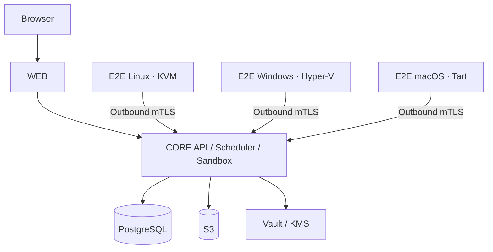

<div align="center">
  
  <h1>DeviLudo</h1>
  <p><strong>AI-native Godot delivery, from requirements to verified game builds</strong></p>
  <p>
    <a href="README.md">简体中文</a> · English
  </p>
  <p>
    <a href="https://github.com/asssaver97/DeviLudo/actions/workflows/ci.yml"></a>
    
    
    
  </p>
</div>

DeviLudo connects game requirements, source code, AI agents, image assets, Godot builds, real-window E2E, and Steam publishing in one traceable delivery pipeline. It can start a project from scratch or keep iterating directly inside an existing local or Git working tree.

> [!IMPORTANT]
> DeviLudo is currently an MVP. The complete local workflow supports Apple Silicon macOS only. Production requires dedicated infrastructure and Linux, Windows, and macOS E2E nodes.

## Table of contents

- [Highlights](#highlights)
- [Delivery workflow](#delivery-workflow)
- [Quick start](#quick-start)
- [Importing and iterating](#importing-and-iterating)
- [Real-interaction E2E](#real-interaction-e2e)
- [Production architecture](#production-architecture)
- [Development and verification](#development-and-verification)
- [Security](#security)

## Highlights

| Capability | What it provides |
| --- | --- |
| AI development | Generate, modify, and repair Godot projects with Claude Code or Codex CLI |
| Existing projects | Link a local directory directly or clone GitHub with host Git credentials; local projects are never uploaded or copied |
| Iterative delivery | Keep specifications, tasks, artifacts, and test evidence across source revisions and workflow iterations |
| Git workflow | Create or switch branches from the project page; automatically commit after successful E2E without pushing |
| Image assets | Generate from an Agent-authored manifest, accept user-supplied files, or use placeholders |
| Godot builds | Produce delivery artifacts while rejecting script, import, startup, and export errors |
| Real E2E | Exercise player actions with OS-level keyboard and mouse input inside disposable graphical VMs |
| Visual evidence | Package self-contained HTML, JSON, logs, real screenshots, baselines, and diffs in a ZIP |
| Steam delivery | Sign per platform, require human approval, upload to Steam, and verify a real clean installation |
| Operations | PostgreSQL/S3/source backup, mTLS, RLS, observability, and restricted task execution |

## Delivery workflow



| Profile | Endpoint |
| --- | --- |
| `VALIDATE` | Agent → assets → build → target-platform E2E |
| `RELEASE` | Agent → assets → build → three-platform E2E → signing → approval → Steam → clean install |

Every development round is a separate workflow. After completion, failure, or cancellation, the next iteration inherits the specification and source binding while preserving all tasks, artifacts, and evidence from earlier rounds.

## Quick start

### Requirements

| Item | Requirement |
| --- | --- |
| Host | Apple Silicon macOS |
| Runtime | Node.js 22, Docker/Colima, Homebrew |
| Virtualization | Tart; the first startup prepares a macOS E2E golden image |
| Disk | At least 35 GiB free is recommended |

```bash
git clone https://github.com/asssaver97/DeviLudo.git
cd DeviLudo
npm ci
npm run local:bootstrap
npm run local:up
```

Open [http://127.0.0.1:3100](http://127.0.0.1:3100), then configure a Claude Code or Codex CLI provider in Settings. An image-generation provider is optional. Local installations use `standalone` mode and require no account.

The first `local:up` downloads a roughly 25 GB macOS base image and creates a versioned Tart golden image. Initialization fails explicitly instead of falling back to host execution. Later starts reuse the image and bootstrap state. Refresh it explicitly with:

```bash
npm run local:up -- --refresh-e2e-vm
```

See [Tart Quick Start](https://tart.run/quick-start/) for the base-image size note.

### Common commands

```bash
npm run local:status   # Show service status
npm run local:logs     # Follow service logs
npm run local:down     # Stop services and keep data
npm run local:reset    # Stop services and delete local data
```

The Agent processes one task at a time by default. On a larger machine, set `DEVILUDO_SANDBOX_CONCURRENCY=2` to run two tasks concurrently. Only `1` and `2` are accepted.

## Importing and iterating

### Local projects

Selecting a project root immediately creates a project named after that directory while analysis continues in the background. Nothing is uploaded through the browser or copied into a second working directory. Before every Agent run, DeviLudo reads the latest content from the original directory and writes changes back only when its baseline has not been modified externally.

### GitHub projects

DeviLudo invokes the host `git` command, so existing credential helpers and SSH agents continue to work and there is no browser-upload size limit. Git credentials are never mounted into containers or stored by DeviLudo.

## Real-interaction E2E

`deviludo.test-manifest.v3` maps approved specifications to executable verification:

1. Start the final delivery package through the operating system from a clean user profile.
2. Read control bounds, visibility, enabled state, and game progress through a read-only semantic UI probe.
3. Perform real clicks, drags, scrolling, keyboard input, and text entry through CGEvent, X11, or SendInput.
4. Require a new probe sequence, state change, and postcondition after every player action.
5. Capture the `1280×720` client area at key checkpoints and perform blank-image checks, region-change checks, or stable-replay comparison.
6. Package requirement coverage, input steps, before/after state, logs, PNGs, and diffs as `deviludo.e2e-evidence.v2`.

Fixed-coordinate clicks, unrelated keys, self-reported success, missing player coverage, Godot script errors, blank screenshots, and excessive visual differences all fail the run. Each platform has a 30-minute budget. Product failures receive at most five automatic repair rounds; infrastructure failures retry only the affected node.

## Production architecture



| Pool | Recommended OS | Responsibility |
| --- | --- | --- |
| `WEB` | Ubuntu 24.04 | Next.js, BFF, and the only public entry point |
| `CORE` | Ubuntu 24.04 x86_64 | API, scheduling, Agent, builds, and publishing |
| `E2E_LINUX` | Ubuntu 24.04 x86_64 | Linux validation in a KVM graphical session |
| `E2E_WINDOWS` | Windows 11 Pro x86_64 | Windows validation in a Hyper-V interactive session |
| `E2E_MACOS` | macOS 15+ Apple Silicon | macOS validation on a Tart graphical desktop |

Production also requires PostgreSQL, S3, Vault/KMS, OpenTelemetry, and load balancing. Public traffic may enter only `WEB`; E2E nodes reach `CORE` only through outbound mTLS.

### Deployment

1. Push a `v*` tag. The [release workflow](.github/workflows/release.yml) creates digest-pinned, Cosign-signed images and bundles.
2. Complete the matching configuration: [WEB](deploy/web/deploy.env.example), [CORE](deploy/core/deploy.env.example), [Linux E2E](deploy/e2e-linux/deploy.env.example), [Windows E2E](deploy/e2e-windows/deploy.json.example), and [macOS E2E](deploy/e2e-macos/deploy.env.example).
3. Provide database, object storage, Vault, TLS, signing, Steam, and signed golden-image credentials.
4. Run `preflight`, `bootstrap`, `deploy`, and `status` on every server.

```bash
sudo ./deploy/<role>/deploy.sh preflight
sudo ./deploy/<role>/deploy.sh bootstrap
sudo ./deploy/<role>/deploy.sh deploy
sudo ./deploy/<role>/deploy.sh status
```

```powershell
.\deploy\e2e-windows\deploy.ps1 -Action preflight
.\deploy\e2e-windows\deploy.ps1 -Action bootstrap
.\deploy\e2e-windows\deploy.ps1 -Action deploy
```

Every platform golden image must contain Godot 4.5.1, Node 22, the v3 guest runner, its GUI driver, and a passing window/input/screenshot smoke. See the [architecture guide](docs/architecture.md) for more detail.

## Development and verification

```bash
npm run check                 # Lint, types, unit tests, architecture, production build
npm run local:executor:test   # Fixture Agent, Godot build, and real macOS VM E2E
npm run local:database:test   # RLS, concurrent claims, fencing, recovery, workflow gates
npm run local:permissions:test
```

The real-provider smoke test may incur charges and runs only when explicitly started with `npm run local:test`.

## Security

- `standalone` has no login system. Never expose it to an untrusted network.
- `platform` asserts sessions and membership through an external account API. Core does not store accounts, passwords, or OAuth data.
- Production Agents run in Kata microVMs. Build and publishing containers use non-root users, read-only filesystems, resource limits, and pinned image digests.
- Provider, Steam, database, and signing credentials must never be committed or placed on command lines.

## Contributing

Issues and pull requests are welcome. Before submitting a change, run:

```bash
npm run check
```

Further reading: [Architecture](docs/architecture.md) · [CI](.github/workflows/ci.yml) · [Release workflow](.github/workflows/release.yml)
