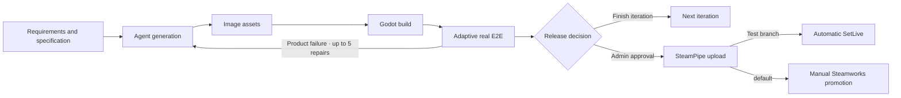
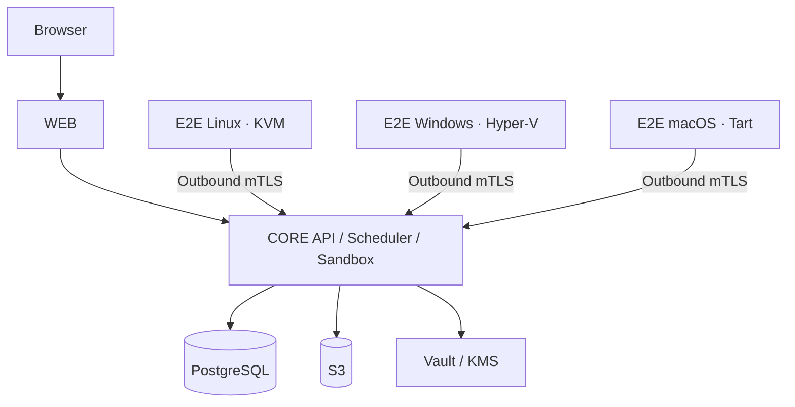

<div align="center">
  
  <h1>DeviLudo</h1>
  <p><strong>AI-native Godot development, testing, and managed delivery</strong></p>
  <p>
    <strong>English</strong>
    ·
    <a href="./README.zh-CN.md">简体中文</a>
  </p>
  <p>
    <a href="https://github.com/asssaver97/DeviLudo/actions/workflows/ci.yml"></a>
    
    
    
  </p>
</div>

DeviLudo connects requirements, source code, specialized AI agents, image assets, Godot builds, real player-operation E2E, and Steam delivery in one traceable workspace. Start from an idea, link an existing local or GitHub project, and continue shipping new iterations without losing earlier specifications, artifacts, or test evidence.

> [!IMPORTANT]
> DeviLudo is an MVP. The complete local workflow currently supports Apple Silicon macOS. Production requires dedicated Core infrastructure and Linux, Windows, and macOS E2E nodes.

## What it does

| Capability | Description |
| --- | --- |
| Multi-Agent collaboration | Design, Development, and Test Agents use independent models and responsibilities in a retained project group chat |
| Existing projects | Work directly in a selected local directory or clone GitHub with the host's Git credentials; no browser upload or source-size limit |
| Iterative delivery | Model every development round as a separate workflow while retaining earlier tasks, artifacts, and evidence |
| Git workflow | Show the current branch, create and switch branches from the project page, and automatically commit after successful E2E without pushing |
| Image assets | Generate from an Agent-authored asset plan, upload user assets, or deliberately use placeholders |
| Godot builds | Produce game artifacts while rejecting script, import, startup, and export errors |
| Adaptive real E2E | Run deterministic journeys and three Test Agent playthroughs through OS-level keyboard, pointer, and virtual gamepad input |
| Evidence and regression | Preserve HTML, JSON, logs, screenshots, video, action traces, visual diffs, and one current managed regression trace per platform |
| Steam delivery | Keep credentials at workspace scope, App/Depot settings at project scope, and release history across iterations |

Project chat runs in Design → Development → Test order. Design owns the gameplay specification and project document, Development reviews implementation and produces code, and Test owns acceptance coverage and regression risk. Only explicit development instructions approve and start the delivery workflow.

## Delivery workflow



Each round has its own workflow instance. A completed, failed, or cancelled round can create the next iteration with the latest specification and source binding, while the previous round remains immutable and available for review.

## Quick start

### Local deployment requirements

| Item | Requirement |
| --- | --- |
| Host | Apple Silicon Mac (M1 or newer) running macOS 15 or newer; Intel Macs and non-macOS hosts are not supported by the local all-in-one workflow |
| Toolchain | Current Xcode Command Line Tools with `swiftc`, Homebrew, Git, Node.js `>=22.13`, and npm |
| Containers | Docker Desktop, or Colima with Docker Compose v2; the bootstrap profile assigns 4 CPUs, 8 GiB RAM, and a 60 GiB sparse disk to Colima |
| Virtualization | Apple Virtualization Framework enabled (`sysctl -n kern.hv_support` returns `1`); Tart runs a 6 GiB macOS Tahoe 26 VM |
| Memory | 16 GiB host RAM minimum; 24 GiB or more recommended when Docker and the E2E VM run together |
| Storage | 140 GiB free recommended before the first full start; Tart currently retains about 90–95 GiB, with additional variable Docker, build, source, and evidence data |
| Network | Outbound HTTPS access to GitHub/GHCR, Homebrew, npm, container registries, and the configured AI providers |
| Local ports | `3100` (web), `8080` (Core), `3199` (local project bridge), and `39000` (object storage) must be available on loopback |

```bash
git clone https://github.com/asssaver97/DeviLudo.git
cd DeviLudo
npm ci
npm run local:bootstrap
npm run local:up
```

Open [http://127.0.0.1:3100](http://127.0.0.1:3100), then configure Claude Code or Codex CLI under **Settings → Agent Settings**. An image-generation provider is optional. Local installations use `standalone` mode and require no account.

`local:bootstrap` installs the container toolchain when it is missing. Keep Xcode Command Line Tools current before Homebrew installs Tart. The first `local:up` downloads roughly 25 GB over the network, then retains an OCI cache, a base clone, and a fingerprinted golden VM. The Tart footprint is currently about 90–95 GiB; Docker images and build caches are additional. The setup script's 35 GiB check is only a base-download preflight, not the complete local footprint.

Initialization fails explicitly instead of falling back to host execution. Refresh the image only when required:

```bash
npm run local:up -- --refresh-e2e-vm
```

Common operations:

```bash
npm run local:status   # Show service status
npm run local:logs     # Follow service logs
npm run local:down     # Stop services and keep data
npm run local:reset    # Stop services and delete local data
```

Agent execution defaults to one concurrent job. Machines with sufficient memory and Provider capacity may set `DEVILUDO_SANDBOX_CONCURRENCY=2`; only `1` and `2` are accepted.

## Existing projects and iteration

### Local directories

Choose a project root and DeviLudo immediately creates a project named after the directory while source analysis continues asynchronously. The browser does not upload or copy the project. Each Agent run reads the latest original directory and writes back only when its recorded baseline has not changed externally.

Deleting a DeviLudo project keeps the bound directory by default. The confirmation dialog provides an explicit option to permanently delete that directory as well.

### GitHub repositories

DeviLudo invokes the host `git` command, so credential helpers and SSH agents continue to work for public and private repositories. Credentials are never mounted into task containers or stored by DeviLudo. Branch creation happens from the existing project's compact branch control—not during import.

## Adaptive real-operation E2E

DeviLudo maintains one current E2E implementation and one current test contract, `deviludo.test-manifest`:

1. Start the final delivery package through the operating system from a clean user directory.
2. Complete every deterministic check and native-input journey. Games declaring controller support must also pass through an OS-level virtual gamepad.
3. Run three independent Test Agent playthroughs per target platform with stable seeds; the read-only Probe Oracle must prove that at least two complete the core loop.
4. Give the Test Agent only a downsampled game frame, approved player goal, allowed actions, and the six latest visible outcomes—never Probe data, logs, credentials, or internal state.
5. Detect visual/state stalls and repeated action loops, allow one recovery attempt, and fail if progress does not resume.
6. Convert the shortest successful trace to semantic controls and replay it twice from clean directories before replacing the platform's current managed regression trace.

Every deterministic journey and adaptive playthrough records `1280×720`, 5 FPS H.264 video. The evidence ZIP contains a self-contained HTML report, structured results, logs, screenshots, videos, JSONL action traces, Oracle decisions, visual diffs, file digests, and the managed regression summary.

System gamepad backends are Core HID on macOS, `uinput` on Linux, and KMDF/VHF on Windows. Every golden image must pass a real Godot window/input/screenshot smoke before accepting jobs. Fixed-coordinate regressions, self-reported success, missing player coverage, Godot errors, blank screenshots, stuck input, or fewer than two successful playthroughs fail the round.

Apple restricts Core HID virtual devices to approved signing entitlements. Local setup detects that capability without weakening macOS security: keyboard/pointer E2E remains available, while a project that declares `GAMEPAD` fails explicitly as unavailable unless the E2E image has an Apple-approved virtual HID driver.

## Steam configuration

- Store the workspace Steamworks build account and credential under **Settings → Steam build account**.
- Store App ID, per-platform Depot IDs, and the test branch in the project's **Managed Steam delivery** panel.
- Credential bodies exist only in the local Secret Store or production Vault; App and Depot IDs are project data, not deployment environment variables.
- SteamPipe may automatically set a test branch live. Promotion to `default` remains an explicit Steamworks administrator action.

## Production architecture



| Pool | Recommended OS | Responsibility |
| --- | --- | --- |
| `WEB` | Ubuntu 24.04 | Next.js, BFF, and the only public entry point |
| `CORE` | Ubuntu 24.04 x86_64 | API, scheduling, Agent execution, builds, evidence, and Steam delivery |
| `E2E_LINUX` | Ubuntu 24.04 x86_64 | Linux validation in a KVM graphical session |
| `E2E_WINDOWS` | Windows 11 Pro x86_64 | Windows validation in a Hyper-V interactive session |
| `E2E_MACOS` | macOS Tahoe 26 Apple Silicon | macOS validation on a Tart graphical desktop |

Production also requires PostgreSQL, S3-compatible object storage, Vault/KMS, OpenTelemetry, TLS, and load balancing. Public traffic enters only `WEB`; E2E nodes reach `CORE` through outbound mTLS.

Push a `v*` tag to generate digest-pinned, Cosign-signed images and deployment bundles. Complete the matching [WEB](deploy/web/deploy.env.example), [CORE](deploy/core/deploy.env.example), [Linux E2E](deploy/e2e-linux/deploy.env.example), [Windows E2E](deploy/e2e-windows/deploy.json.example), and [macOS E2E](deploy/e2e-macos/deploy.env.example) configuration, then run the role's `preflight`, `bootstrap`, `deploy`, and `status` actions.

## Development

```bash
npm run check                 # Lint, types, unit tests, architecture, production build
npm run local:executor:test   # Agent fixture, Godot build, and real macOS VM E2E
npm run local:database:test   # RLS, claims, fencing, recovery, workflow gates
npm run local:permissions:test
```

The real-provider smoke may incur charges and runs only when explicitly started with `npm run local:test`.

## Security

- `standalone` has no login system. Never expose it to an untrusted network.
- `platform` delegates sessions and membership to an external account service; Core stores no passwords or OAuth identities.
- Production Agents run in Kata microVMs. Build and publishing containers use non-root users, read-only filesystems, resource limits, and pinned image digests.
- Provider, Steam, database, and signing credentials must never be committed or placed on command lines.

## Contributing

Issues and pull requests are welcome. Run `npm run check` before submitting changes.

[CI](.github/workflows/ci.yml) · [Release workflow](.github/workflows/release.yml)
