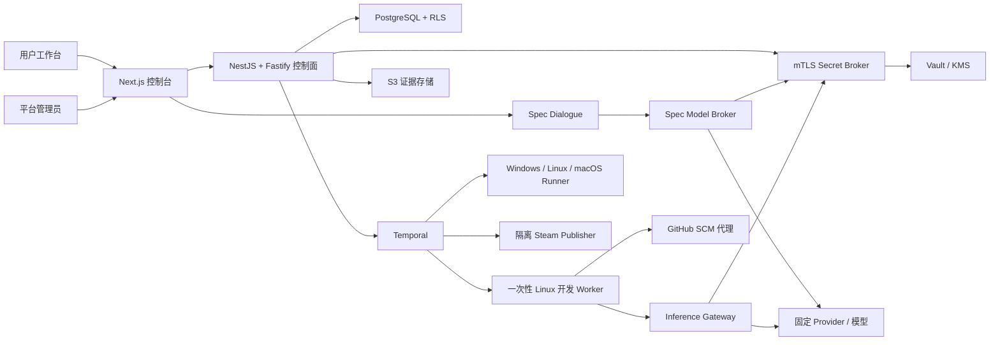

# DeviLudo

DeviLudo 是一个受邀制、多租户的游戏 AI 开发控制面。首版面向 Godot 4 桌面单机游戏，把“游戏构想”串成可审计的完整交付链路：

`构想对话 → 规格批准 → Agent 开发/修复 → Windows/Linux/macOS E2E → 用户反馈迭代 → 合并 → Steam 私有 Beta 回装测试 → 外部发布门禁`

本仓库包含可运行的产品工作台与管理后台、领域状态机、Claude Code/Codex CLI 安全适配器、分平台 Runner fencing 与签名作业协议、证据链、NestJS/Fastify 控制面入口、Temporal 工作流适配层，以及本地集成基础设施。

## 已实现

- `/`：从当前租户的权威项目目录选择项目，并展示对应候选版本流水线、跨平台状态、审计流和 Runner 集群；无项目时明确为空，不以演示数据回退。
- `/projects`：经 PostgreSQL RLS 与独立 Project Repository Broker 列出当前账号仍可访问的项目；项目创建者或仍控制对应 GitHub App installation 的用户才能看到条目，侧栏不再固定到示例项目。本地测试模式展示明确标记的隔离 fixture。
- `/projects/new`：生产环境先从当前已验证 GitHub App installation 实时列出可见仓库，并以数值 installation/repository ID 原子创建项目和仓库绑定；浏览器不能指定 owner、仓库名或默认分支。绑定后进入可交互多轮构想、实时 `GameSpecRevision`、验收标准、冻结测试计划和明确批准动作。本地测试模式继续使用隔离草稿夹具。
- `/projects/{projectId}`：按签名租户会话读取权威项目/仓库资料和当前规格快照；空项目从 revision 0 冷启动，不复用演示规格。候选验收门禁显示反馈与合并动作；自动修复预算耗尽时只显示人工修改入口，新反馈创建不可变规格，必须重新批准后才恢复开发。
- 项目页“本地交付控制台”：使用本地 D1 持久化流程快照与事件，可完整验证 Provider 暂停/恢复、Fixture Agent、三平台矩阵、验收、main SHA、MFA、Steam Beta 回装和外部批准门禁；候选接受只走空正文、独立幂等的正式验收端点，通用交付动作不能代替用户决定。项目选择按“项目→租户→平台”解析，规格批准时冻结 Claude Code 或 Codex CLI 的精确 Profile、配置来源、安装、镜像、CLI/Adapter、Provider、凭据版本、模型、预算与测试计划，随后管理配置变化不会改写运行中任务。main 发布门禁与 Steam 回装阶段还可演练失败证据冻结、旧发布授权撤销、人工修改说明和新规格批准。页面刷新和服务重启后状态仍保留。
- `/admin/agents`：Claude Code（初始全局默认）与 Codex CLI 可分别发现官方候选，并管理版本、安装、灰度、回滚、Provider、凭据、三级继承、健康和审计；“健康与审计”直接消费角色作用域的权威健康投影，展示最近 24 小时追加式推理使用记录、配置 before/after 差异和由 Installation/Provider/Profile 绑定推导的告警。平台级读取要求数据库角色能显式关闭 RLS，租户/项目读取先设置 RLS 上下文；无法证明作用域时只报告账本不可用，不返回部分聚合。版本、SBOM、漏洞与安装状态只显示当前控制面投影，加载或失败时不会回退到预置结果。本地测试使用隔离 D1 夹具，生产 Web 则验证路由绑定的管理员断言并经独立 HTTPS/mTLS Connector 转发到 NestJS 控制面。生产角色由可信入口注入，浏览器不能模拟或覆盖。
- `/settings/agents`：TenantAdmin 写入租户 BYOK、创建第三方 Provider/Profile 草稿并选择租户默认；API Key 明文仅进入 Vault，第三方端点通过探针且由 SecurityAdmin 激活前不会生效。
- `/projects/{projectId}/agent-settings`：ProjectOwner 从租户/平台已经批准的 ACTIVE Profile 中选择项目 Agent。服务端先通过项目仓库 Broker 校验精确项目归属，再签发项目作用域控制面身份；项目层不读取或复制 Provider 凭据。
- `/projects/{projectId}/steam-settings`：ProjectOwner 读取权威 Steam 发布就绪状态，并创建五分钟、绑定当前用户/浏览器/Build Account 的一次性配置意图。App、Windows/Linux/macOS Depot、私有 Beta 分支和分支密码只在独立 Steam Secure UI 中提交；Access Broker 在创建、进入隔离页和最终提交时均复核活跃 ProjectOwner，并复核 App 权限后把密码直接写入 Vault，在同一 PostgreSQL RLS 事务中冻结新的 Depot/Release revision。主站、本地 Fixture、Agent、工作区与日志均不接收密码或 SecretRef。
- `/settings/connections`：GitHub App 安装授权和 Steam Guard 会话入口；不接收或保存 GitHub/Steam 主密码。GitHub 生产路由使用短期签名平台会话、内部 mTLS Broker、PKCE 与 PostgreSQL RLS 状态存储；Steam Web 路由只创建隔离登记会话并跳转到固定 HTTPS Broker，账号密码与 Guard 码不经过 Web 控制面。未配置 Broker 时入口明确返回外部门禁，不伪造“已连接/会话可用”。
- `/runners`、`/evidence`：共享当前租户的权威项目选择，读取所选项目的本地健康状态、持久交付快照和真实 Godot evidence manifest；每次生产构想、规格批准、反馈、候选验收、交付取消、交付投影、Runner 或证据操作都会先用完整 GitHub 用户断言向 Project Repository Broker 重新验证精确 installation 访问权，同租户内知道项目 UUID 的其他用户不能绕过项目目录读取或修改状态。生产 Runner 视图经同一只读 mTLS 投影服务，在租户 RLS 下只查询该项目各平台最新租约，并以注册心跳、证书期限和状态推导 READY/STALE/隔离状态。生产证据目录最多返回该项目最近 50 个不可变 manifest，在服务端和浏览器端重验 bundle SHA-256、冻结规格/测试计划、执行锁、Runner Toolchain、提交、目标矩阵、分平台结果与失效墓碑，但不暴露 S3 object key 或下载授权。项目切换时旧快照立即隐藏，未连接的目标不会显示为在线。
- `lib/domain`：规格、迭代、AgentVersion、Installation、Profile、Run、E2E、Steam 的严格状态机和不可变快照。
- `lib/agent`、`adapters`、`lib/security`：统一 Runtime Adapter、精确 CLI 参数、固定模型、SSRF/DNS rebinding/redirect 校验、短期 run token、SecretRef 与显式 fallback。
- `lib/orchestration`：可重放的确定性交付工作流；Provider、用户、MFA 和 Valve 等长等待均为 signal。
- 自动修复不会复用已经终态化的 AgentRun。Agent 或候选 E2E 失败会创建新的不可变 Run/短期推理授权；Agent 失败还会保存经过脱敏、限长且内容寻址的阶段化诊断，后继提示词不读取原始 stderr。E2E 修复精确绑定前序候选 SHA、Draft PR、失败 evidence digest 与分平台日志/JUnit/截图/视频摘要，并从该候选继续开发。每轮最多自动修复 3 次；第 3 次失败后工作流停止继续计费，进入人工规格修订，只有用户提交并批准新的不可变草稿才会重置额度。若实际 main SHA 发布门禁或 Steam 私有 Beta 回装失败，Runner 会发出独立失败信号，平台立即撤销旧 main/MFA/BuildID/发布与外部审批权限，并要求用户从失败 main 基线创建、批准新规格，绝不把页面留在伪“测试中”状态。项目页和总览直接展示修复次数、失败绑定、原/后继运行配置和候选或 main 基线，不维护可篡改的前端副本。移动的管理员默认值不会改变这条修复链；Temporal patch marker 与投影多模式重放继续兼容升级前的无上限历史。
- `services/temporal`：按控制面、Agent、Runner、SCM、Steam 固定路由活动；服务端以 mTLS/SPIFFE、PostgreSQL 租约 inbox 和全绑定回执实现幂等接收。三段外部审批逐门绑定，公开发布只有收到相同 Steam BuildID 的完成信号后才进入终态。
- `services/agent-worker`：真实进程监督边界；无 shell spawn、路径/环境白名单、SecretRef、JSONL 事件、日志脱敏、取消和超时。交付取消被 Broker 投影为无回执的权威 `CANCELLED` 终态，Worker 停止轮询且不伪造 `AGENT_FAILED`，失效租约会中止仍在运行的 microVM。测试只注入 fake spawn，不会调用本机 Agent。
- `services/inference-gateway`：可独立启动的生产 mTLS Gateway；短期 run token、PostgreSQL RLS 不可变运行/Provider 投影、逐请求 usage 账本、mTLS 凭据 Broker 短租约、Responses/Messages 固定 Connector、DNS/CNAME 固定与重定向复检均为硬门禁。同一 run 的请求先取得数据库 fencing claim，崩溃或缺少终态 usage 的请求进入 `RECONCILIATION_REQUIRED`，不会静默重试并重复计费；仅 SecurityAdmin 可凭上游证据摘要选择“确认未计费”或“记录确切 token”，Gateway 按冻结价格原子核销并留痕。Provider 激活探针实际覆盖精确模型、认证、usage、流式输出、工具调用、取消和超时，失败不覆盖当前生效配置。
- `services/secret-broker`：隔离的 Vault KV v2 权威边界；控制面只可写入/撤销 Provider Key，GitHub/Identity 只可存取一次性 PKCE 或租用固定 OAuth Client Secret，Inference Gateway 与规格模型 Broker 分别以互斥 mTLS 角色、经权威绑定重验后取得五分钟内的短租约。PostgreSQL 仅保存不透明引用、单向摘要、fencing 状态和追加式审计，明文不进入业务数据库、Agent 工作区或普通日志。
- `services/spec-dialogue`：独立低延迟构想服务，不安装 Claude Code/Codex、不允许工具调用；每轮在同一 PostgreSQL RLS 事务中先复核活跃 `ProjectOwner`/`TenantAdmin`，再追加消息和一对 `GAME_SPEC`/`TEST_PLAN` 草稿，审计员不会触发模型调用。明确批准会再次复核写权限，另建 `APPROVED`/`FROZEN` 后继并写入 Runner 权威绑定，草稿本身永不修改。生产模型只经 mTLS Broker 调用，本服务不持有第三方 API Key 或 Base URL。
- `services/spec-model-broker`：补齐生产构想模型服务端；只接受规格对话/反馈 workload，固定管理员目录中一个 ACTIVE 平台 Profile 的精确 `smallFastModel`，不接受客户端模型、端点或凭据。每次调用先进入租户 RLS 防重账本，再经独立 Secret Broker 角色取得五分钟 Key 租约；Responses/Messages 均强制结构化 JSON、空工具列表、DNS 固定和跳转复检。已完成结果精确重放，已发送但终态不明的调用进入 `INDETERMINATE`，不会自动重复计费；只有互斥的 SecurityAdmin mTLS 对账身份提交“确认未计费”或精确 usage 证据后，当前 `dispatchGeneration` 才能追加留痕并恢复重试。
- `services/spec-workflow-bridge`：把已提交规格经 mTLS、租户 RLS、可回收租约和幂等事件可靠接入 Temporal；首轮严格按 `SPEC_READY → SPEC_APPROVED`，反馈迭代只投递批准事件。规格批准与 Agent 配置锁定是两个独立状态，只有后者的权威服务可进入开发队列。
- `services/user-acceptance`：生产候选反馈/接受/取消入口只接受平台签名会话经 mTLS Web workload 转发的用户决定；服务端解析唯一等待中的验收 action、带第 3 次失败修复上下文的规格批准 action，或已撤销发布权限的 main/Steam 失败 action。反馈持久化 `GENERATING → DRAFT_READY → COMPLETED` 并创建沿用同一 aggregate 的下一对 DRAFT 规格/测试计划及新对话；候选反馈会原子失效旧证据，人工修复接管则验证失败 action 与草稿祖先而不伪造候选证据。接受操作仍须先记录不可变 actor、候选回执、commit、PR 与有效证据绑定，再发出 `USER_ACCEPTED` 供 SCM 合并。取消只接受原因，服务端重新验证活跃 ProjectOwner/TenantAdmin 资格，锁定当前 replay-validated 投影后向 Temporal 发送带状态/历史序号的幂等信号；过期信号安全失效，成功取消再由控制面同事务撤销 Agent、推理、Runner 与 Steam 权限。模型失败不失效证据，投递失败不重复生成草案或用户决定。
- `services/scm-proxy`：本地 SCM 信任边界及 GitHub App 远端 Connector。安装使用单次 state + PKCE 用户授权，只有用户令牌证明当前用户可访问精确 installation 后才绑定；OAuth code/token/refresh token 均不入库。独立项目仓库 Broker 通过 mTLS Web workload 接收签名账号主体，签发并立即撤销 metadata-only installation token，用 GitHub 实时结果派生 owner/name/default branch，再在同一 RLS 事务中写入项目、仓库绑定和防重放回执。远端候选包和用户验收均须 Ed25519 签名；隔离合并 Broker 从 RLS 数据库重验已投递的用户决定、Draft PR 与未失效 E2E 证据，经 mTLS KMS 获取五分钟验收证明后才使用仓库级短期安装令牌合并。Git Data API 创建 blob/tree/commit/`deviludo/*` ref 和 Draft PR；外部副作用使用带租约的持久 claim，支持崩溃恢复且不会并发重复执行，并归档 GitHub 实际 main SHA 与 source digest。
- `services/steam-publisher`：独立、无 Agent 的 Steam 发布边界；Runner 原始导出必须先经隔离 mTLS 定稿服务完成 Linux Sigstore、Windows Authenticode 或 macOS Developer ID 签名（macOS 还必须有公证证据），RC v2 同时绑定原始/签名后摘要、签名身份和证据对象。随后才可凭 main SHA/证据/目标矩阵、新鲜 MFA、精确 App 的加密 `config.vdf` SecretRef 和无密码 SteamCMD 参数上传密码保护 Beta，再调度三系统干净 Steam Client 回装；Valve 审核、首次发布和默认分支确认保持外部门禁。
- `services/steam-depot-finalizer`：生产专用的独立 TLS 1.3/mTLS 发布签名服务。每个租户/发布/平台操作先写入 PostgreSQL RLS 幂等账本，再由摘要固定、无 shell 的原生控制器从宿主机 keystore/HSM 完成 Authenticode、Sigstore 或 Developer ID/公证。API、数据库、进程环境与回执只包含内容地址和公开证据；Steam 发布器还会独立重验 S3 对象后才签发 RC v2。
- `services/agent-supply-chain`：独立 mTLS Agent 供应链 Broker及其单文件策略执行器；固定官方 NPM 目录与签名 key、SHA-512/SHA-256 双重完整性、安全 USTAR 解包、ClamAV/Trivy/Syft、只读无网络合成任务、BuildKit、KMS 镜像签名和 Fleet 灰度均生成不可变回执。策略失败自动拒绝或隔离，普通网络/扫描器故障不会被误判为安全终态。
- `services/evidence-archive`：独立、无 Agent 的 mTLS 证据归档服务；重新验证矩阵 bundle 的 canonical digest、平台覆盖和状态，使用 S3 SigV4 条件写保存内容寻址证据，失败时生成不可变 repair prompt，任何重试都不得覆盖已有对象。
- `services/artifact-preparer` 与 `services/godot-testkit`：前者从权威 SCM 快照确定性生成 `source.tar.zst`、验证 canonical v2 矩阵测试计划，通过 mTLS 获取五分钟 S3 grant 并在签名租户/证书授权和两个输入对象回执通过后才写入租户 RLS 下的不可变执行锁；后者在物理 Runner 上以固定 Godot 命令执行核心循环/胜负/暂停设置/保存读取与性能门禁，并生成六类内容寻址证据。
- `services/runner-control` 的独立 Toolchain Publisher：只接受供应链专用 mTLS/SPIFFE 身份，把 TestKit、构建清单、SBOM、漏洞扫描和许可台账与当前 `ONLINE`、租户已分配的物理 Runner 能力原子组合成项目级不可变 Revision。导出模板摘要只能从 Runner 注册记录派生，发布请求、规格模型和浏览器均不能提供或覆盖。
- 规格批准会在同一 PostgreSQL RLS 事务中解析与 Godot 版本、目标矩阵完全兼容的最新项目 Runner Toolchain，并把其不可变 revision/digest 写入冻结测试计划；缺少兼容版本时整笔审批回滚，数据库触发器也拒绝任何旁路写入的不兼容绑定。
- “接受并发布”生产路由只接受空 POST、幂等键和绑定方法/路径的短期平台会话；它不会接受客户端 main SHA、证据状态或 `x-mfa-proof`，而是跳转到固定 HTTPS MFA broker。Broker 在租户 RLS 下重新确认请求者仍是活跃 `ProjectOwner`/`TenantAdmin` 且就是该工作流已完成不可变候选验收的 actor，再查询权威发布快照并续跑 Temporal；审计员或另一账号不能复用已知 Release ID。反馈、验收服务本身也在数据库内复核同一写权限，不依赖 Web 进程代传的 actor。
- `services/local-runtime`：仅 loopback 的 Godot 验证侧车；为固定样例创建隔离 Git 提交，执行真实 import/boot/TestKit/导出检查并生成 manifest、JUnit 和日志证据。
- `services/local-agent-runtime`：仅 loopback 的 Agent 就绪与执行边界；读取本机 Claude Code/Codex CLI 的精确版本，并把版本、WorkerImage、Gateway、锁定 Provider 绑定探针和显式启用状态作为联合门禁。`/v1/runs` 必须复用预检，默认未注入隔离执行器时返回 503，绝不回退为直接启动 CLI。
- 三个本地 sidecar 分别使用 `local:dev` 每次启动生成的独立 256-bit HMAC 会话。规格读写、Godot 执行/证据读取和 Agent 预检/运行全部绑定精确受众、方法、路径、正文摘要、时间与单次 nonce；知道 loopback 端口或伪造旧固定请求头均不能取得 sidecar 权限，任一服务的 Key 也不能跨受众使用。
- 本地候选反馈走与生产相同的不可变语义：只有目标矩阵已通过并等待用户验收，或 post-main/Steam 失败已进入人工修复接管时才能提交；规格 sidecar 从已批准会话派生新的 DRAFT 会话，旧批准 authority 和证据保留但立即失效。新草稿必须再次明确批准并取得新 Run；本地 smoke 会对后继 Run 再次运行真实 Godot，并单独证明缺少导出模板的真实候选不能越过目标矩阵门禁。
- `lib/observability`：所有 Web、控制面、工作流、Agent、Runner、SCM、证据与 Steam 生产启动入口在应用模块加载前注册固定服务身份的 OpenTelemetry SDK，通过 OTLP/protobuf 导出追踪并自动传播 W3C `tracecontext`。生产不能关闭追踪；URL query、Cookie、认证头、提示词、源码和凭据不会进入 span，静态 OTLP Header 凭据也被禁止。
- `IsolatedLocalAgentExecutor`：把 Claude/Codex Adapter、短期 token broker、Agent Worker 监督器和 SCM 代理组合成一次尝试；完成回执固定租户、测试计划、turn/cost/token 预算、超时和 base/candidate 提交。服务端只有在注入可信 workspace provisioner 与 token broker 后才能启用它。
- 项目页“真实 Agent 启动预检”：将持久快照中的 Profile、CLI、镜像、Provider、凭据版本和模型锁提交给本机探针，显示准确阻塞原因；只有 `READY` 才显示启动入口。完成回执必须再次绑定全部锁定字段以及 SCM 候选 SHA、source digest、changed-files 和 usage，之后才写入候选状态。
- `db`、`drizzle`：38 张 D1 Beta 表、不可变绑定触发器、GitHub 安装授权/SCM 回执、Steam 会话/上传 claim/Build 回执、分平台 Runner 和本地交付事件迁移。
- `infra`：PostgreSQL 强制 RLS、Temporal、Redis、MinIO、Vault、OpenTelemetry 的本地集成骨架。
- `openapi/deviludo.yaml`：生产 API 合同；站点预览在 `/api/admin/**` 暴露同等演示操作。

## 架构



关键边界：

- Claude Code 与 Codex CLI 只在一次性开发 Worker 内运行；E2E Runner 和 Steam 发布节点不安装自主 Agent。
- 任务入队时锁定 Profile revision、Installation、镜像 digest、CLI/Adapter 版本、Provider revision、模型、凭据版本、预算、规格、提交和目标矩阵。
- Provider 失败默认进入 `WAITING_PROVIDER`；只有项目预先允许的同 Agent 精确 fallback 才能使用，永不在 Claude/Codex 间静默切换。
- CLI 只拿到 15 分钟、绑定 `tenant + project + run + profile + credential + model + budget` 的内部 token；上游 Key 仅在 Gateway/Vault 边界内出现。
- Runner 结果必须匹配 `attempt_id + fencing_token + seq_no + commit_sha + source_digest`，迟到或越序结果会被拒绝。
- Windows/Linux/macOS 各自获得独立的签名 lease 和 fencing token；Runner 只能结束自己的平台流，矩阵结果及最终 evidence bundle 由控制面汇总，公开 Web 路由不接收 Runner 写入。
- 候选 PR 的证据不能授权发布。合并后必须针对实际 main SHA 重跑完整门禁。

更多细节见 [架构说明](docs/architecture.md)、[运行时安全](docs/runtime-security.md) 和 [工作流说明](docs/workflows.md)。

## 本地启动

要求 Node.js `>=22.13`。

```bash
npm install
npm run local:install-export-templates
npm run local:dev
```

打开 `http://127.0.0.1:3000`。该命令同时启动 Web 控制面、`127.0.0.1:4311` Godot 验证侧车、`127.0.0.1:4312` Agent 就绪探针和 `127.0.0.1:4313` 确定性规格对话侧车，四个进程都只绑定 loopback。启动器为三个 sidecar 分别生成临时 HMAC Key；每个 Key 只进入 Web 与对应 sidecar，并以 `0600` 权限写入被忽略的 `.deviludo/` 供本地冒烟验证，退出时全部删除。产品页面和 D1 持久状态不会调用真实模型、GitHub 或 Steam；项目页的“真实本机验证”会运行已安装的 Godot，并把证据写入被忽略的 `.deviludo/`。Agent 探针只读取 `claude --version` / `codex --version`；若版本不等于任务锁定值，管理员页会如实显示 `VERSION_MISMATCH` 并阻止执行。

模板安装器只接受版本目录中固定的 Godot 官方构建，下载固定 URL 后校验归档大小、SHA-256 和全部压缩路径，再原子发布只读文件清单。验证侧车不会直接复用可变的编辑器 HOME；它会重验安装清单和 `macos.zip` 摘要，并只把精确版本目录挂载到本次运行的隔离 HOME。已有未验证目录不会被覆盖。

管理员页的本地写操作会进入 `/api/admin/**`，执行角色检查、幂等处理并生成脱敏审计事件。版本发现可填写精确稳定版或预发布版本；本地页面留空时复用只读探针观察到的实际 CLI 版本，但不会自动批准或激活。版本目录保留官方包来源、发行说明和供应链回执，链接必须同时匹配固定官方域名、Agent 和精确版本。任务预检直接核对不可变 Run 锁与实际 CLI，因此新任务可以安全使用管理员更新后的精确版本。没有签名/hash/SBOM/扫描证据时版本批准返回 `SUPPLY_CHAIN_GATES_FAILED`；没有受信 Provider Connector 时“测试并激活”返回 `PROVIDER_PROBE_NOT_CONFIGURED`，草稿和原生效配置均保留。

生产部署应把 `GET /api/health` 配置为 Web 流量就绪探针。它会用与业务路由相同的客户端契约校验构想、验收、GitHub、身份、管理、投影与 Steam 发布所需的全部 Broker；任何缺失或无效配置都会返回 `503`，且不会在响应中暴露内部 URL 或凭据。

若缺少与 Godot 版本匹配的 export templates，本机脚本检查即使全部通过，聚合状态仍为 `WAITING_DEPENDENCY`，发布门禁停在 `WAITING_EXPORT_TEMPLATES`，目标矩阵不能启动；安装模板后可重新验证同一锁定运行。Windows/Linux 保持未连接，直到真实 mTLS Runner 可用。

保持测试站运行时，可在另一个终端检查关键页面和健康 API：

```bash
npm run local:smoke
```

端口选择、退出信号和故障排查见 [本地测试说明](docs/local-testing.md)。

完整校验：

```bash
npm run check
```

该命令依次执行严格类型检查、ESLint、生产构建，以及领域、安全、工作流和 HTTP 集成测试。
它还会先校验全部 `start:*` 服务都通过统一可观测启动器运行、入口文件存在，且生产入口使用的运维环境变量已进入版本化示例；配置漂移会直接阻断 CI。也可单独运行 `npm run config:contract`。

## 本地基础设施

复制 `.env.example` 为未跟踪的 `.env`，再启动集成依赖：

```bash
npm run infra:up
npm run infra:status
```

依赖服务只绑定到 `127.0.0.1`。状态检查会认证 PostgreSQL/Redis、确认数据库已应用到 migration `059`，并验证 Temporal、MinIO、Vault 与 OTel Collector。使用 `npm run infra:down` 停止。该 Compose 仅用于开发；生产应使用高可用 PostgreSQL/PITR、Temporal 集群、TLS Redis、版本化并锁定的 S3、自动解封 Vault/KMS，以及独立网络分区的开发 Worker、E2E Runner、Inference Connector 和 Steam Publisher。

## API

生产 API 使用独立域名，因此 UI 的 `GET /admin/agents` 与 API 的 `GET /admin/agents` 不冲突。本地单进程预览将 API 映射到 `/api/admin/agents`。

所有写操作要求：

- `Authorization: Bearer …`
- `Idempotency-Key`
- 适当角色：`PlatformAgentAdmin`、`SecurityAdmin`、`TenantAdmin` 或 `ProjectOwner`
- 乐观 revision/version（涉及配置更新时）

API Key 只允许写入或替换。Web 与公共控制面响应只返回不可逆掩码指纹、版本和时间，不返回 Vault `SecretRef`，也不提供读取明文的接口。

完整路径和 schema 见 [OpenAPI 合同](openapi/deviludo.yaml)。

## 真实连接上线清单

仓库默认不会执行外部副作用。部署到真实环境前需要运维方提供：

1. GitHub App 的 App/Client ID、私钥与 Client Secret 的 Vault 引用、登录与 Setup/PKCE Callback 域名、Identity Broker mTLS 身份和允许安装的组织；用户只通过一次性邀请登录，不保存 GitHub 密码。
2. Claude/Codex Provider 的 SecurityAdmin 审批、数据政策确认、Vault Key 与全套探针结果。
3. 内部镜像库、签名密钥、SBOM/漏洞/恶意软件扫描器和隔离 microVM Worker 池。
4. 通过出站 mTLS 注册的 Windows、Linux、macOS Runner 与固定 Godot/export-template digest；供应链身份通过 `start:runner-toolchain-publisher` 发布项目级不可变 Toolchain 后，规格才允许批准。
5. Steamworks 最小权限 build account；首次人工完成 Steam Guard 后只保存加密 `config.vdf` 会话。
6. 代码签名、公证、素材许可台账、MFA 和 Valve/手机确认的外部 approval signal。

这些边界刻意不使用模拟凭据“自动绕过”。未配置时工作流会停在 `WAITING_PROVIDER` 或 `EXTERNAL_APPROVAL_REQUIRED`。

Agent 供应链生产打包、固定工具参数和策略配置方法见 [Agent 供应链运维说明](docs/agent-supply-chain.md)。
受邀 GitHub 登录、mTLS 部署与邀请签发见 [身份 Broker 运维说明](docs/identity.md)。
生产 Agent 管理入口、双 HMAC 域和 Connector 部署见 [管理员控制面运维说明](docs/admin-control-plane.md)。

## 目录

```text
app/                    Next/vinext 工作台、页面与演示 API
components/             产品控制台与 Agent 管理后台
lib/domain/             不可变领域模型和门禁
lib/agent/              Provider/Profile/事件协议
lib/security/           SSRF、凭据、短期 token
lib/orchestration/      确定性交付工作流
adapters/               Claude Code / Codex CLI Adapter
services/               控制面、Temporal、Agent Worker、Inference Gateway、Secret Broker 与 SCM 代理
fixtures/               固定 Godot 本机验证样例与测试脚本
db/ + drizzle/          D1 Beta schema/migrations
infra/                  Postgres/Temporal/Redis/S3/Vault/OTel
openapi/                生产 HTTP 合同
tests/                  领域、安全、工作流与 HTTP 集成测试
```
