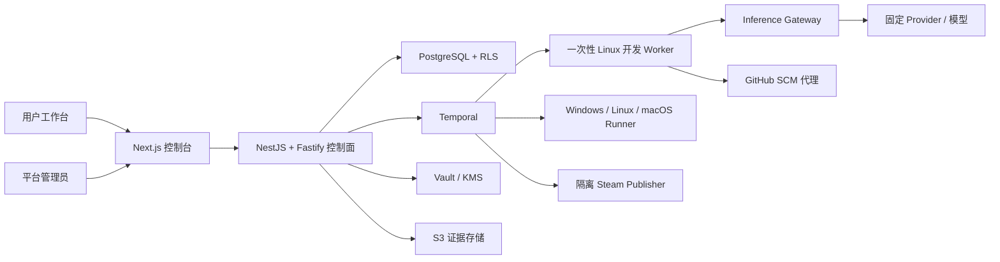

# DeviLudo

DeviLudo 是一个受邀制、多租户的游戏 AI 开发控制面。首版面向 Godot 4 桌面单机游戏，把“游戏构想”串成可审计的完整交付链路：

`构想对话 → 规格批准 → Agent 开发/修复 → Windows/Linux/macOS E2E → 用户反馈迭代 → 合并 → Steam 私有 Beta 回装测试 → 外部发布门禁`

本仓库包含可运行的产品工作台与管理后台、领域状态机、Claude Code/Codex CLI 安全适配器、分平台 Runner fencing 与签名作业协议、证据链、NestJS/Fastify 控制面入口、Temporal 工作流适配层，以及本地集成基础设施。

## 已实现

- `/`：项目总览、候选版本流水线、跨平台状态、审计流和 Runner 集群。
- `/projects/new`：生产环境先从当前已验证 GitHub App installation 实时列出可见仓库，并以数值 installation/repository ID 原子创建项目和仓库绑定；浏览器不能指定 owner、仓库名或默认分支。绑定后进入可交互多轮构想、实时 `GameSpecRevision`、验收标准、冻结测试计划和明确批准动作。本地测试模式继续使用隔离草稿夹具。
- `/projects/ember-archipelago`：候选 PR 上的反馈迭代；新反馈创建不可变规格并让旧证据失效。
- 项目页“本地交付控制台”：使用本地 D1 持久化流程快照与事件，可完整验证 Provider 暂停/恢复、Fixture Agent、三平台矩阵、验收、main SHA、MFA、Steam Beta 回装和外部批准门禁；页面刷新和服务重启后状态仍保留。
- `/admin/agents`：Claude Code（初始全局默认）与 Codex CLI 的目录、版本、安装、灰度、回滚、Provider、凭据、三级继承、健康和审计；版本阻止、灰度/回滚、平台默认、Provider 草稿与 RBAC 已接入本地幂等 API，刷新后从服务端重新读取。
- `/settings/connections`：GitHub App 安装授权和 Steam Guard 会话入口；不接收或保存 GitHub/Steam 主密码。GitHub 生产路由使用短期签名平台会话、内部 mTLS Broker、PKCE 与 PostgreSQL RLS 状态存储；Steam Web 路由只创建隔离登记会话并跳转到固定 HTTPS Broker，账号密码与 Guard 码不经过 Web 控制面。未配置 Broker 时入口明确返回外部门禁，不伪造“已连接/会话可用”。
- `/runners`、`/evidence`：读取本地健康状态、持久交付快照和真实 Godot evidence manifest；未连接的 Windows/Linux 不显示为在线。
- `lib/domain`：规格、迭代、AgentVersion、Installation、Profile、Run、E2E、Steam 的严格状态机和不可变快照。
- `lib/agent`、`adapters`、`lib/security`：统一 Runtime Adapter、精确 CLI 参数、固定模型、SSRF/DNS rebinding/redirect 校验、短期 run token、SecretRef 与显式 fallback。
- `lib/orchestration`：可重放的确定性交付工作流；Provider、用户、MFA 和 Valve 等长等待均为 signal。
- `services/temporal`：按控制面、Agent、Runner、SCM、Steam 固定路由活动；服务端以 mTLS/SPIFFE、PostgreSQL 租约 inbox 和全绑定回执实现幂等接收。三段外部审批逐门绑定，公开发布只有收到相同 Steam BuildID 的完成信号后才进入终态。
- `services/agent-worker`：真实进程监督边界；无 shell spawn、路径/环境白名单、SecretRef、JSONL 事件、日志脱敏、取消和超时。测试只注入 fake spawn，不会调用本机 Agent。
- `services/inference-gateway`：可独立启动的生产 mTLS Gateway；短期 run token、PostgreSQL RLS 不可变运行/Provider 投影、逐请求 usage 账本、mTLS 凭据 Broker 短租约、Responses/Messages 固定 Connector、DNS/CNAME 固定与重定向复检均为硬门禁。同一 run 的请求先取得数据库 fencing claim，崩溃或缺少终态 usage 的请求进入 `RECONCILIATION_REQUIRED`，不会静默重试并重复计费；仅 SecurityAdmin 可凭上游证据摘要选择“确认未计费”或“记录确切 token”，Gateway 按冻结价格原子核销并留痕。Provider 激活探针实际覆盖精确模型、认证、usage、流式输出、工具调用、取消和超时，失败不覆盖当前生效配置。
- `services/spec-dialogue`：独立低延迟构想服务，不安装 Claude Code/Codex、不允许工具调用；每轮在同一 PostgreSQL RLS 事务中追加消息和一对 `GAME_SPEC`/`TEST_PLAN` 草稿。明确批准会另建 `APPROVED`/`FROZEN` 后继并写入 Runner 权威绑定，草稿本身永不修改。生产模型只经 mTLS Broker 调用，本服务不持有第三方 API Key 或 Base URL。
- `services/spec-workflow-bridge`：把已提交规格经 mTLS、租户 RLS、可回收租约和幂等事件可靠接入 Temporal；首轮严格按 `SPEC_READY → SPEC_APPROVED`，反馈迭代只投递批准事件。规格批准与 Agent 配置锁定是两个独立状态，只有后者的权威服务可进入开发队列。
- `services/user-acceptance`：生产候选反馈/接受入口只接受平台签名会话经 mTLS Web workload 转发的用户决定；服务端解析唯一等待中的验收 action。反馈持久化 `GENERATING → DRAFT_READY → COMPLETED`，创建沿用同一 aggregate 的下一对 DRAFT 规格/测试计划及新对话后，才由控制面原子失效旧证据；接受则先记录不可变 actor、候选回执、commit、PR 与有效证据绑定，再发出 `USER_ACCEPTED` 供 SCM 合并。模型失败不失效证据，投递失败不重复生成草案或用户决定。
- `services/scm-proxy`：本地 SCM 信任边界及 GitHub App 远端 Connector。安装使用单次 state + PKCE 用户授权，只有用户令牌证明当前用户可访问精确 installation 后才绑定；OAuth code/token/refresh token 均不入库。独立项目仓库 Broker 通过 mTLS Web workload 接收签名账号主体，签发并立即撤销 metadata-only installation token，用 GitHub 实时结果派生 owner/name/default branch，再在同一 RLS 事务中写入项目、仓库绑定和防重放回执。远端候选包和用户验收均须 Ed25519 签名；隔离合并 Broker 从 RLS 数据库重验已投递的用户决定、Draft PR 与未失效 E2E 证据，经 mTLS KMS 获取五分钟验收证明后才使用仓库级短期安装令牌合并。Git Data API 创建 blob/tree/commit/`deviludo/*` ref 和 Draft PR；外部副作用使用带租约的持久 claim，支持崩溃恢复且不会并发重复执行，并归档 GitHub 实际 main SHA 与 source digest。
- `services/steam-publisher`：独立、无 Agent 的 Steam 发布边界；只接受绑定 main SHA/证据/目标矩阵的签名 RC 与新鲜 MFA 授权，使用精确 App 的加密 `config.vdf` SecretRef 和无密码 SteamCMD 参数上传密码保护 Beta，再调度三系统干净 Steam Client 回装证据；Valve 审核、首次发布和默认分支确认保持外部门禁。
- `services/agent-supply-chain`：独立 mTLS Agent 供应链 Broker及其单文件策略执行器；固定官方 NPM 目录与签名 key、SHA-512/SHA-256 双重完整性、安全 USTAR 解包、ClamAV/Trivy/Syft、只读无网络合成任务、BuildKit、KMS 镜像签名和 Fleet 灰度均生成不可变回执。策略失败自动拒绝或隔离，普通网络/扫描器故障不会被误判为安全终态。
- `services/evidence-archive`：独立、无 Agent 的 mTLS 证据归档服务；重新验证矩阵 bundle 的 canonical digest、平台覆盖和状态，使用 S3 SigV4 条件写保存内容寻址证据，失败时生成不可变 repair prompt，任何重试都不得覆盖已有对象。
- `services/artifact-preparer` 与 `services/godot-testkit`：前者从权威 SCM 快照确定性生成 `source.tar.zst`、验证 canonical v2 矩阵测试计划，通过 mTLS 获取五分钟 S3 grant 并在签名租户/证书授权和两个输入对象回执通过后才写入租户 RLS 下的不可变执行锁；后者在物理 Runner 上以固定 Godot 命令执行核心循环/胜负/暂停设置/保存读取与性能门禁，并生成六类内容寻址证据。
- “接受并发布”生产路由只接受空 POST、幂等键和绑定方法/路径的短期平台会话；它不会接受客户端 main SHA、证据状态或 `x-mfa-proof`，而是跳转到固定 HTTPS MFA broker，由 broker 查询权威发布快照并续跑 Temporal。
- `services/local-runtime`：仅 loopback 的 Godot 验证侧车；为固定样例创建隔离 Git 提交，执行真实 import/boot/TestKit/导出检查并生成 manifest、JUnit 和日志证据。
- `services/local-agent-runtime`：仅 loopback 的 Agent 就绪与执行边界；读取本机 Claude Code/Codex CLI 的精确版本，并把版本、WorkerImage、Gateway、锁定 Provider 绑定探针和显式启用状态作为联合门禁。`/v1/runs` 必须复用预检，默认未注入隔离执行器时返回 503，绝不回退为直接启动 CLI。
- `IsolatedLocalAgentExecutor`：把 Claude/Codex Adapter、短期 token broker、Agent Worker 监督器和 SCM 代理组合成一次尝试；完成回执固定租户、测试计划、turn/cost/token 预算、超时和 base/candidate 提交。服务端只有在注入可信 workspace provisioner 与 token broker 后才能启用它。
- 项目页“真实 Agent 启动预检”：将持久快照中的 Profile、CLI、镜像、Provider、凭据版本和模型锁提交给本机探针，显示准确阻塞原因；只有 `READY` 才显示启动入口。完成回执必须再次绑定全部锁定字段以及 SCM 候选 SHA、source digest、changed-files 和 usage，之后才写入候选状态。
- `db`、`drizzle`：38 张 D1 Beta 表、不可变绑定触发器、GitHub 安装授权/SCM 回执、Steam 会话/上传 claim/Build 回执、分平台 Runner 和本地交付事件迁移。
- `infra`：PostgreSQL 强制 RLS、Temporal、Redis、MinIO、Vault、OpenTelemetry 的本地集成骨架。
- `openapi/deviludo.yaml`：生产 API 合同；站点预览在 `/api/admin/**` 暴露同等演示操作。

## 架构



关键边界：

- Claude Code 与 Codex CLI 只在一次性开发 Worker 内运行；E2E Runner 和 Steam 发布节点不安装自主 Agent。
- 任务入队时锁定 Profile revision、Installation、镜像 digest、CLI/Adapter 版本、Provider revision、模型、凭据版本、预算、规格、提交和目标矩阵。
- Provider 失败默认进入 `WAITING_PROVIDER`；只有项目预先允许的同 Agent 精确 fallback 才能使用，永不在 Claude/Codex 间静默切换。
- CLI 只拿到 15 分钟、绑定 `tenant + project + run + profile + credential + model + budget` 的内部 token；上游 Key 仅在 Gateway/Vault 边界内出现。
- Runner 结果必须匹配 `attempt_id + fencing_token + seq_no + commit_sha + source_digest`，迟到或越序结果会被拒绝。
- Windows/Linux/macOS 各自获得独立的签名 lease 和 fencing token；Runner 只能结束自己的平台流，矩阵结果及最终 evidence bundle 由控制面汇总，公开 Web 路由不接收 Runner 写入。
- 候选 PR 的证据不能授权发布。合并后必须针对实际 main SHA 重跑完整门禁。

更多细节见 [架构说明](docs/architecture.md)、[运行时安全](docs/runtime-security.md) 和 [工作流说明](docs/workflows.md)。

## 本地启动

要求 Node.js `>=22.13`。

```bash
npm install
npm run local:dev
```

打开 `http://127.0.0.1:3000`。该命令同时启动 Web 控制面、`127.0.0.1:4311` Godot 验证侧车、`127.0.0.1:4312` Agent 就绪探针和 `127.0.0.1:4313` 确定性规格对话侧车，四个进程都只绑定 loopback。产品页面和 D1 持久状态不会调用真实模型、GitHub 或 Steam；项目页的“真实本机验证”会运行已安装的 Godot，并把证据写入被忽略的 `.deviludo/`。Agent 探针只读取 `claude --version` / `codex --version`；若版本不等于任务锁定值，管理员页会如实显示 `VERSION_MISMATCH` 并阻止执行。

管理员页的本地写操作会进入 `/api/admin/**`，执行角色检查、幂等处理并生成脱敏审计事件。没有签名/hash/SBOM/扫描证据时版本批准返回 `SUPPLY_CHAIN_GATES_FAILED`；没有受信 Provider Connector 时“测试并激活”返回 `PROVIDER_PROBE_NOT_CONFIGURED`，草稿和原生效配置均保留。

若缺少与 Godot 版本匹配的 export templates，本机 headless 测试仍可通过，但发布门禁会停在 `WAITING_EXPORT_TEMPLATES`。Windows/Linux 保持未连接，直到真实 mTLS Runner 可用。

保持测试站运行时，可在另一个终端检查关键页面和健康 API：

```bash
npm run local:smoke
```

端口选择、退出信号和故障排查见 [本地测试说明](docs/local-testing.md)。

完整校验：

```bash
npm run check
```

该命令依次执行严格类型检查、ESLint、生产构建，以及领域、安全、工作流和 HTTP 集成测试。

## 本地基础设施

复制 `.env.example` 为未跟踪的 `.env`，再启动集成依赖：

```bash
docker compose -f infra/docker-compose.yml up
```

这套 Compose 仅用于开发。生产应使用高可用 PostgreSQL/PITR、Temporal 集群、TLS Redis、版本化并锁定的 S3、自动解封 Vault/KMS，以及独立网络分区的开发 Worker、E2E Runner、Inference Connector 和 Steam Publisher。

## API

生产 API 使用独立域名，因此 UI 的 `GET /admin/agents` 与 API 的 `GET /admin/agents` 不冲突。本地单进程预览将 API 映射到 `/api/admin/agents`。

所有写操作要求：

- `Authorization: Bearer …`
- `Idempotency-Key`
- 适当角色：`PlatformAgentAdmin`、`SecurityAdmin`、`TenantAdmin` 或 `ProjectOwner`
- 乐观 revision/version（涉及配置更新时）

API Key 只允许写入或替换。响应只返回 Vault `SecretRef`、不可逆掩码指纹、版本和时间，不提供读取明文的接口。

完整路径和 schema 见 [OpenAPI 合同](openapi/deviludo.yaml)。

## 真实连接上线清单

仓库默认不会执行外部副作用。部署到真实环境前需要运维方提供：

1. GitHub App 的 App/Client ID、私钥与 Client Secret 的 Vault 引用、Setup/PKCE Callback 域名和允许安装的组织。
2. Claude/Codex Provider 的 SecurityAdmin 审批、数据政策确认、Vault Key 与全套探针结果。
3. 内部镜像库、签名密钥、SBOM/漏洞/恶意软件扫描器和隔离 microVM Worker 池。
4. 通过出站 mTLS 注册的 Windows、Linux、macOS Runner 与固定 Godot/export-template digest。
5. Steamworks 最小权限 build account；首次人工完成 Steam Guard 后只保存加密 `config.vdf` 会话。
6. 代码签名、公证、素材许可台账、MFA 和 Valve/手机确认的外部 approval signal。

这些边界刻意不使用模拟凭据“自动绕过”。未配置时工作流会停在 `WAITING_PROVIDER` 或 `EXTERNAL_APPROVAL_REQUIRED`。

Agent 供应链生产打包、固定工具参数和策略配置方法见 [Agent 供应链运维说明](docs/agent-supply-chain.md)。

## 目录

```text
app/                    Next/vinext 工作台、页面与演示 API
components/             产品控制台与 Agent 管理后台
lib/domain/             不可变领域模型和门禁
lib/agent/              Provider/Profile/事件协议
lib/security/           SSRF、凭据、短期 token
lib/orchestration/      确定性交付工作流
adapters/               Claude Code / Codex CLI Adapter
services/               控制面、Temporal、Agent Worker、Inference Gateway 与 SCM 代理
fixtures/               固定 Godot 本机验证样例与测试脚本
db/ + drizzle/          D1 Beta schema/migrations
infra/                  Postgres/Temporal/Redis/S3/Vault/OTel
openapi/                生产 HTTP 合同
tests/                  领域、安全、工作流与 HTTP 集成测试
```
