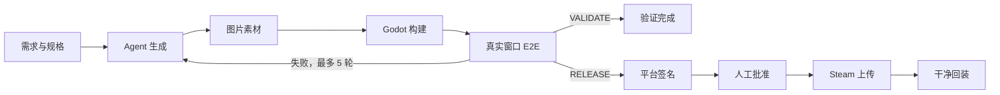
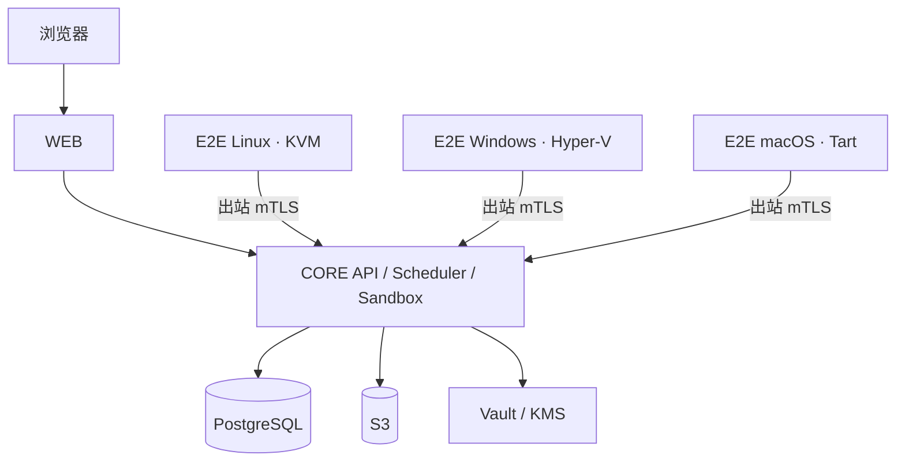

<div align="center">
  
  <h1>DeviLudo</h1>
  <p><strong>从需求到可验证游戏制品的 AI 原生 Godot 交付平台</strong></p>
  <p>
    简体中文 · <a href="README.en.md">English</a>
  </p>
  <p>
    <a href="https://github.com/asssaver97/DeviLudo/actions/workflows/ci.yml"></a>
    
    
    
  </p>
</div>

DeviLudo 把游戏需求、项目源码、AI Agent、图片素材、Godot 构建、真实窗口 E2E 与 Steam 发布连接成一条可追踪的交付流水线。它既能从零生成项目，也能直接在已有的本地或 Git 仓库中持续迭代。

> [!IMPORTANT]
> 项目当前处于 MVP 阶段。完整本地链路仅支持 Apple Silicon macOS；生产模式需要独立基础设施和 Linux、Windows、macOS E2E 节点。

## 目录

- [核心能力](#核心能力)
- [交付流程](#交付流程)
- [快速开始](#快速开始)
- [导入与迭代项目](#导入与迭代项目)
- [真实操作 E2E](#真实操作-e2e)
- [生产架构](#生产架构)
- [开发与验证](#开发与验证)
- [安全说明](#安全说明)

## 核心能力

| 能力 | 说明 |
| --- | --- |
| AI 开发 | 使用 Claude Code 或 Codex CLI 生成、修改和修复 Godot 项目 |
| 已有项目 | 直接关联本地目录，或使用宿主机 Git 凭证克隆 GitHub 仓库；不上传、不复制本地项目 |
| 多轮迭代 | 按源码 revision 和 workflow iteration 保留规格、任务、制品与测试历史 |
| Git 工作流 | 在项目页创建或切换分支；E2E 成功后自动 commit，但不会自动 push |
| 图片素材 | 根据 Agent 素材清单自动生成，也支持用户提供文件或占位素材 |
| Godot 构建 | 生成可交付制品，并拦截脚本、导入、启动和导出错误 |
| 真实 E2E | 在一次性图形虚拟机内通过系统级键鼠完成玩家操作并验证状态变化 |
| 可视化证据 | 输出自包含 HTML、JSON、日志、真实截图、视觉基线和 diff 的 ZIP |
| Steam 发布 | 平台签名、人工批准、Steam 上传及真实干净回装验证 |
| 可运维性 | PostgreSQL/S3/源码备份恢复、mTLS、RLS、可观测性和受限任务执行 |

## 交付流程



| 模式 | 终点 |
| --- | --- |
| `VALIDATE` | Agent → 素材 → 构建 → 目标平台 E2E |
| `RELEASE` | Agent → 素材 → 构建 → 三平台 E2E → 签名 → 批准 → Steam → 干净回装 |

每轮开发都是独立工作流。完成、失败或取消后可以创建下一轮，继承规格和源码绑定，同时保留上一轮任务、制品与测试证据。

## 快速开始

### 环境要求

| 项目 | 要求 |
| --- | --- |
| 系统 | Apple Silicon macOS |
| 运行时 | Node.js 22、Docker/Colima、Homebrew |
| 虚拟化 | Tart；首次启动会准备 macOS E2E 金镜像 |
| 磁盘 | 建议至少 35 GiB 可用空间 |

```bash
git clone https://github.com/asssaver97/DeviLudo.git
cd DeviLudo
npm ci
npm run local:bootstrap
npm run local:up
```

打开 [http://127.0.0.1:3100](http://127.0.0.1:3100)，然后在设置页配置 Claude Code 或 Codex CLI Provider。图片生成 Provider 为可选项。本地默认采用 `standalone` 模式，不需要登录。

首次 `local:up` 会下载约 25 GB 的 macOS 基础镜像并生成版本化 Tart 金镜像；失败时会明确停止，不会降级到宿主机执行。后续启动会复用镜像和初始化状态。需要主动刷新时运行：

```bash
npm run local:up -- --refresh-e2e-vm
```

基础镜像体积参见 [Tart Quick Start](https://tart.run/quick-start/)。

### 常用命令

```bash
npm run local:status   # 查看服务状态
npm run local:logs     # 跟踪服务日志
npm run local:down     # 停止服务，保留数据
npm run local:reset    # 停止服务并删除本地数据
```

Agent 默认单任务运行。资源充足时可设置 `DEVILUDO_SANDBOX_CONCURRENCY=2` 并行处理两个任务；允许值仅为 `1` 或 `2`。

## 导入与迭代项目

### 本地项目

选择项目根目录后，DeviLudo 会立即用目录名创建项目，并在后台分析源码。项目内容不会经过浏览器上传，也不会复制到其他工作目录。每次 Agent 启动前都会读取原目录最新内容；只有目录基线未被外部修改时，结果才会安全写回原目录。

### GitHub 项目

DeviLudo 调用宿主机 `git` 克隆仓库，因此可复用已有的 credential helper 或 SSH agent，也不存在浏览器上传的 64 MiB 限制。Git 凭证不会挂载到容器，也不会保存到 DeviLudo。

## 真实操作 E2E

DeviLudo 使用 `deviludo.test-manifest.v3` 将批准规格映射为可执行验证：

1. 从干净用户目录通过操作系统启动最终交付包。
2. 通过只读语义 UI Probe 获取控件位置、可见性、启用状态和游戏进度。
3. 使用 CGEvent、X11 或 SendInput 执行真实点击、拖拽、滚动、键盘和文本输入。
4. 每次玩家操作后验证新的 Probe 序号、状态变化和断言。
5. 在关键检查点截取 `1280×720` 客户区画面，并执行空白检测、区域变化或稳定重放比较。
6. 将需求覆盖、输入步骤、前后状态、日志、PNG 和 diff 打包为 `deviludo.e2e-evidence.v2`。

固定坐标点击、无关按键、程序自报成功、缺少玩家需求覆盖、Godot 脚本错误、空白截图或视觉差异超限都会判定失败。每个平台总预算 30 分钟，产品失败最多自动修复 5 轮；基础设施失败只重试对应节点。

## 生产架构



| 服务器池 | 推荐系统 | 职责 |
| --- | --- | --- |
| `WEB` | Ubuntu 24.04 | Next.js、BFF、唯一公网入口 |
| `CORE` | Ubuntu 24.04 x86_64 | API、调度、Agent、构建和发布 |
| `E2E_LINUX` | Ubuntu 24.04 x86_64 | KVM 图形会话中的 Linux 验证 |
| `E2E_WINDOWS` | Windows 11 Pro x86_64 | Hyper-V 交互会话中的 Windows 验证 |
| `E2E_MACOS` | macOS 15+ Apple Silicon | Tart 图形桌面中的 macOS 验证 |

生产环境还需要 PostgreSQL、S3、Vault/KMS、OpenTelemetry 和负载均衡。公网流量只能进入 `WEB`；E2E 节点只通过出站 mTLS 访问 `CORE`。

### 部署

1. 推送 `v*` tag，由[发布工作流](.github/workflows/release.yml)生成带摘要和 Cosign 签名的镜像及 bundle。
2. 复制并填写对应配置：[WEB](deploy/web/deploy.env.example)、[CORE](deploy/core/deploy.env.example)、[Linux E2E](deploy/e2e-linux/deploy.env.example)、[Windows E2E](deploy/e2e-windows/deploy.json.example)、[macOS E2E](deploy/e2e-macos/deploy.env.example)。
3. 准备数据库、对象存储、Vault、TLS、签名、Steam 和已签名金镜像凭据。
4. 在每台服务器执行 `preflight`、`bootstrap`、`deploy` 和 `status`。

```bash
sudo ./deploy/<role>/deploy.sh preflight
sudo ./deploy/<role>/deploy.sh bootstrap
sudo ./deploy/<role>/deploy.sh deploy
sudo ./deploy/<role>/deploy.sh status
```

```powershell
.\deploy\e2e-windows\deploy.ps1 -Action preflight
.\deploy\e2e-windows\deploy.ps1 -Action bootstrap
.\deploy\e2e-windows\deploy.ps1 -Action deploy
```

三平台金镜像必须包含 Godot 4.5.1、Node 22、v3 guest runner、对应 GUI driver，以及通过的窗口、输入和截图 smoke。更多设计细节见[架构说明](docs/architecture.md)。

## 开发与验证

```bash
npm run check                 # Lint、类型、单元测试、架构和生产构建
npm run local:executor:test   # Agent fixture、Godot 构建和真实 macOS VM E2E
npm run local:database:test   # RLS、并发领取、fencing、恢复和工作流门禁
npm run local:permissions:test
```

真实 Provider 冒烟可能产生费用，只会在显式运行 `npm run local:test` 时执行。

## 安全说明

- `standalone` 没有登录系统，请勿暴露到不可信网络。
- `platform` 通过外部账号 API 断言会话和成员关系，Core 不保存账号、密码或 OAuth 数据。
- 生产 Agent 在 Kata microVM 中运行；构建和发布容器使用非 root、只读文件系统、资源限制及固定镜像摘要。
- Provider、Steam、数据库和签名凭据不得提交到仓库或写入命令行。

## 参与贡献

Issue 和 Pull Request 均欢迎。提交前请运行：

```bash
npm run check
```

相关资料：[架构](docs/architecture.md) · [CI](.github/workflows/ci.yml) · [发布流程](.github/workflows/release.yml)
