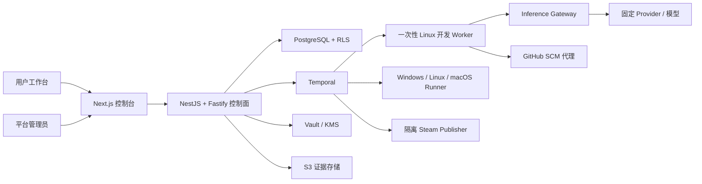

# DeviLudo

DeviLudo 是一个受邀制、多租户的游戏 AI 开发控制面。首版面向 Godot 4 桌面单机游戏，把“游戏构想”串成可审计的完整交付链路：

`构想对话 → 规格批准 → Agent 开发/修复 → Windows/Linux/macOS E2E → 用户反馈迭代 → 合并 → Steam 私有 Beta 回装测试 → 外部发布门禁`

本仓库包含可运行的产品工作台与管理后台、领域状态机、Claude Code/Codex CLI 安全适配器、分平台 Runner fencing 与签名作业协议、证据链、NestJS/Fastify 控制面入口、Temporal 工作流适配层，以及本地集成基础设施。

## 已实现

- `/`：项目总览、候选版本流水线、跨平台状态、审计流和 Runner 集群。
- `/projects/new`：可交互的多轮构想对话、实时 `GameSpecRevision`、验收标准、冻结测试计划和明确批准动作。构想助手与开发 Agent 分离。
- `/projects/ember-archipelago`：候选 PR 上的反馈迭代；新反馈创建不可变规格并让旧证据失效。
- 项目页“本地交付控制台”：使用本地 D1 持久化流程快照与事件，可完整验证 Provider 暂停/恢复、Fixture Agent、三平台矩阵、验收、main SHA、MFA、Steam Beta 回装和外部批准门禁；页面刷新和服务重启后状态仍保留。
- `/admin/agents`：Claude Code（初始全局默认）与 Codex CLI 的目录、版本、安装、灰度、回滚、Provider、凭据、三级继承、健康和审计；版本阻止、灰度/回滚、平台默认、Provider 草稿与 RBAC 已接入本地幂等 API，刷新后从服务端重新读取。
- `/settings/connections`：GitHub App OAuth 和 Steam Guard 会话流程；不接收或保存 GitHub/Steam 主密码。
- `/runners`、`/evidence`：读取本地健康状态、持久交付快照和真实 Godot evidence manifest；未连接的 Windows/Linux 不显示为在线。
- `lib/domain`：规格、迭代、AgentVersion、Installation、Profile、Run、E2E、Steam 的严格状态机和不可变快照。
- `lib/agent`、`adapters`、`lib/security`：统一 Runtime Adapter、精确 CLI 参数、固定模型、SSRF/DNS rebinding/redirect 校验、短期 run token、SecretRef 与显式 fallback。
- `lib/orchestration`：可重放的确定性交付工作流；Provider、用户、MFA 和 Valve 等长等待均为 signal。
- `services/agent-worker`：真实进程监督边界；无 shell spawn、路径/环境白名单、SecretRef、JSONL 事件、日志脱敏、取消和超时。测试只注入 fake spawn，不会调用本机 Agent。
- `services/inference-gateway`：短期 run token、不可变运行注册表、精确 Provider/凭据/模型、累计预算与逐请求 DNS/SSRF 门禁；未配置可信 Vault/DNS-pinning Connector 时拒绝推理请求。
- `services/scm-proxy`：无网络的本地 SCM 信任边界；Git 元数据位于 Agent 工作区之外，禁用 shell、hooks、credential helper、file protocol 与全局配置，拒绝 symlink/嵌套 `.git`/特殊文件，并生成权威 base/candidate SHA、changed-files 与 SHA-256 tree digest。
- `services/local-runtime`：仅 loopback 的 Godot 验证侧车；为固定样例创建隔离 Git 提交，执行真实 import/boot/TestKit/导出检查并生成 manifest、JUnit 和日志证据。
- `services/local-agent-runtime`：仅 loopback 的 Agent 就绪与执行边界；读取本机 Claude Code/Codex CLI 的精确版本，并把版本、WorkerImage、Gateway、锁定 Provider 绑定探针和显式启用状态作为联合门禁。`/v1/runs` 必须复用预检，默认未注入隔离执行器时返回 503，绝不回退为直接启动 CLI。
- `IsolatedLocalAgentExecutor`：把 Claude/Codex Adapter、短期 token broker、Agent Worker 监督器和 SCM 代理组合成一次尝试；完成回执固定租户、测试计划、turn/cost/token 预算、超时和 base/candidate 提交。服务端只有在注入可信 workspace provisioner 与 token broker 后才能启用它。
- 项目页“真实 Agent 启动预检”：将持久快照中的 Profile、CLI、镜像、Provider、凭据版本和模型锁提交给本机探针，显示准确阻塞原因；只有 `READY` 才显示启动入口。完成回执必须再次绑定全部锁定字段以及 SCM 候选 SHA、source digest、changed-files 和 usage，之后才写入候选状态。
- `db`、`drizzle`：26 张 D1 Beta 表、不可变触发器及本地交付事件迁移。
- `infra`：PostgreSQL 强制 RLS、Temporal、Redis、MinIO、Vault、OpenTelemetry 的本地集成骨架。
- `openapi/deviludo.yaml`：生产 API 合同；站点预览在 `/api/admin/**` 暴露同等演示操作。

## 架构



关键边界：

- Claude Code 与 Codex CLI 只在一次性开发 Worker 内运行；E2E Runner 和 Steam 发布节点不安装自主 Agent。
- 任务入队时锁定 Profile revision、Installation、镜像 digest、CLI/Adapter 版本、Provider revision、模型、凭据版本、预算、规格、提交和目标矩阵。
- Provider 失败默认进入 `WAITING_PROVIDER`；只有项目预先允许的同 Agent 精确 fallback 才能使用，永不在 Claude/Codex 间静默切换。
- CLI 只拿到 15 分钟、绑定 `tenant + project + run + profile + credential + model + budget` 的内部 token；上游 Key 仅在 Gateway/Vault 边界内出现。
- Runner 结果必须匹配 `attempt_id + fencing_token + seq_no + commit_sha + source_digest`，迟到或越序结果会被拒绝。
- Windows/Linux/macOS 各自获得独立的签名 lease 和 fencing token；Runner 只能结束自己的平台流，矩阵结果及最终 evidence bundle 由控制面汇总，公开 Web 路由不接收 Runner 写入。
- 候选 PR 的证据不能授权发布。合并后必须针对实际 main SHA 重跑完整门禁。

更多细节见 [架构说明](docs/architecture.md)、[运行时安全](docs/runtime-security.md) 和 [工作流说明](docs/workflows.md)。

## 本地启动

要求 Node.js `>=22.13`。

```bash
npm install
npm run local:dev
```

打开 `http://127.0.0.1:3000`。该命令同时启动 Web 控制面、`127.0.0.1:4311` Godot 验证侧车和 `127.0.0.1:4312` Agent 就绪探针，三个进程都只绑定 loopback。产品页面和 D1 持久状态不会调用真实模型、GitHub 或 Steam；项目页的“真实本机验证”会运行已安装的 Godot，并把证据写入被忽略的 `.deviludo/`。Agent 探针只读取 `claude --version` / `codex --version`；若版本不等于任务锁定值，管理员页会如实显示 `VERSION_MISMATCH` 并阻止执行。

管理员页的本地写操作会进入 `/api/admin/**`，执行角色检查、幂等处理并生成脱敏审计事件。没有签名/hash/SBOM/扫描证据时版本批准返回 `SUPPLY_CHAIN_GATES_FAILED`；没有受信 Provider Connector 时“测试并激活”返回 `PROVIDER_PROBE_NOT_CONFIGURED`，草稿和原生效配置均保留。

若缺少与 Godot 版本匹配的 export templates，本机 headless 测试仍可通过，但发布门禁会停在 `WAITING_EXPORT_TEMPLATES`。Windows/Linux 保持未连接，直到真实 mTLS Runner 可用。

保持测试站运行时，可在另一个终端检查关键页面和健康 API：

```bash
npm run local:smoke
```

端口选择、退出信号和故障排查见 [本地测试说明](docs/local-testing.md)。

完整校验：

```bash
npm run check
```

该命令依次执行严格类型检查、ESLint、生产构建，以及领域、安全、工作流和 HTTP 集成测试。

## 本地基础设施

复制 `.env.example` 为未跟踪的 `.env`，再启动集成依赖：

```bash
docker compose -f infra/docker-compose.yml up
```

这套 Compose 仅用于开发。生产应使用高可用 PostgreSQL/PITR、Temporal 集群、TLS Redis、版本化并锁定的 S3、自动解封 Vault/KMS，以及独立网络分区的开发 Worker、E2E Runner、Inference Connector 和 Steam Publisher。

## API

生产 API 使用独立域名，因此 UI 的 `GET /admin/agents` 与 API 的 `GET /admin/agents` 不冲突。本地单进程预览将 API 映射到 `/api/admin/agents`。

所有写操作要求：

- `Authorization: Bearer …`
- `Idempotency-Key`
- 适当角色：`PlatformAgentAdmin`、`SecurityAdmin`、`TenantAdmin` 或 `ProjectOwner`
- 乐观 revision/version（涉及配置更新时）

API Key 只允许写入或替换。响应只返回 Vault `SecretRef`、不可逆掩码指纹、版本和时间，不提供读取明文的接口。

完整路径和 schema 见 [OpenAPI 合同](openapi/deviludo.yaml)。

## 真实连接上线清单

仓库默认不会执行外部副作用。部署到真实环境前需要运维方提供：

1. GitHub App 的 App ID、私钥 Vault 引用、回调域名和允许安装的组织。
2. Claude/Codex Provider 的 SecurityAdmin 审批、数据政策确认、Vault Key 与全套探针结果。
3. 内部镜像库、签名密钥、SBOM/漏洞/恶意软件扫描器和隔离 microVM Worker 池。
4. 通过出站 mTLS 注册的 Windows、Linux、macOS Runner 与固定 Godot/export-template digest。
5. Steamworks 最小权限 build account；首次人工完成 Steam Guard 后只保存加密 `config.vdf` 会话。
6. 代码签名、公证、素材许可台账、MFA 和 Valve/手机确认的外部 approval signal。

这些边界刻意不使用模拟凭据“自动绕过”。未配置时工作流会停在 `WAITING_PROVIDER` 或 `EXTERNAL_APPROVAL_REQUIRED`。

## 目录

```text
app/                    Next/vinext 工作台、页面与演示 API
components/             产品控制台与 Agent 管理后台
lib/domain/             不可变领域模型和门禁
lib/agent/              Provider/Profile/事件协议
lib/security/           SSRF、凭据、短期 token
lib/orchestration/      确定性交付工作流
adapters/               Claude Code / Codex CLI Adapter
services/               控制面、Temporal、Agent Worker、Inference Gateway 与 SCM 代理
fixtures/               固定 Godot 本机验证样例与测试脚本
db/ + drizzle/          D1 Beta schema/migrations
infra/                  Postgres/Temporal/Redis/S3/Vault/OTel
openapi/                生产 HTTP 合同
tests/                  领域、安全、工作流与 HTTP 集成测试
```
