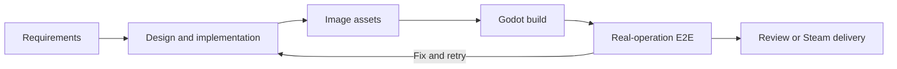

<div align="center">
  
  <h1>DeviLudo</h1>
  <p><strong>AI-powered game development automation for Godot</strong></p>
  <p>
    <strong>English</strong>
    ·
    <a href="./README.zh-CN.md">简体中文</a>
  </p>
  <p>
    <a href="https://github.com/asssaver97/DeviLudo/actions/workflows/ci.yml"></a>
    
    
    
    
  </p>
</div>

DeviLudo turns requirements and existing Godot projects into tested desktop builds and Steam-ready releases. Design, Development, and Test agents collaborate on the same project, generate image assets, build the game, operate it through native input, and preserve evidence for every iteration.

> [!IMPORTANT]
> DeviLudo is currently an MVP. The complete local workflow requires an Apple Silicon Mac. Cross-platform production validation uses separate Linux, Windows, and macOS E2E nodes.

## Core workflow



| Capability | What it provides |
| --- | --- |
| Specialized agents | Design, Development, and Test agents with separate roles and model settings |
| Existing-project support | Direct access to a local directory or a GitHub clone using the host's Git credentials |
| Iterative development | A separate, reviewable workflow for each round without losing previous artifacts or evidence |
| Asset and build pipeline | Image generation, Godot validation, and desktop build artifacts |
| Real-operation E2E | Deterministic journeys and adaptive playthroughs using OS-level keyboard, pointer, and gamepad input |
| Delivery evidence | Reports, logs, screenshots, videos, action traces, and visual diffs |
| Steam delivery | Project-level App/Depot configuration, SteamPipe upload, and retained release history |

## Quick start

### Requirements

| Item | Requirement |
| --- | --- |
| Host | Apple Silicon Mac (M1 or newer) with macOS 15 or newer |
| Toolchain | Current Xcode Command Line Tools, Git, Node.js `>=22.13`, and npm |
| Containers | `local:up` automatically prepares and starts Colima, or starts an existing Docker Desktop installation |
| Virtualization | Apple Virtualization Framework enabled; `sysctl -n kern.hv_support` must return `1` |
| Resources | 16 GiB RAM minimum, 24 GiB recommended, and about 140 GiB free disk space before first setup |
| Network | HTTPS access to GitHub/GHCR, Homebrew, npm, container registries, and the selected AI provider |
| Ports | Loopback ports `3100`, `8080`, `3199`, and `39000` must be available |

### Install and run

```bash
git clone https://github.com/asssaver97/DeviLudo.git
cd DeviLudo
npm ci
npm run local:up
```

`local:up` installs missing Homebrew container dependencies and starts the configured Colima or Docker Desktop runtime automatically. The first startup then builds the container stack and makes Web and Core available while the roughly 25 GB macOS E2E environment finishes in the background. Its live stage and percentage appear on the Runtime page. Keep about 140 GiB free for the VM, images, build caches, source, and test evidence.

Open [http://127.0.0.1:3100](http://127.0.0.1:3100), then go to **Settings → Agent Settings** and select either:

- Codex CLI already signed in on the host; or
- Claude Code with a compatible Images API connection and image model.

Image generation follows the selected agent runtime automatically.

## Using DeviLudo

1. Add a local Godot project directory or clone a GitHub repository.
2. Describe the feature, change, or game goal in the project chat.
3. Review the Design agent's specification, then give an explicit development instruction to start implementation.
4. Follow the build and E2E results. Product failures can return to Development for up to five repair rounds.
5. Review the evidence, start another iteration, or approve Steam delivery.

Local-directory projects are edited in place. GitHub projects use the host's credential helper or SSH agent. A successful E2E run creates a commit on the selected branch but does not push it automatically.

### E2E results

DeviLudo launches the final package from a clean user directory and operates it through native keyboard, pointer, and—when required—virtual gamepad input. Each target platform runs deterministic checks plus three adaptive Test-agent playthroughs.

The resulting evidence bundle includes a self-contained HTML report, structured results, logs, screenshots, H.264 videos, action traces, Oracle decisions, visual diffs, file digests, and the current regression summary.

### Steam delivery

1. Save the Steamworks build credential under **Settings → Steam build credential**.
2. Configure the App ID, per-platform Depot IDs, and test branch in the project's **Steam delivery** panel.
3. Approve delivery after E2E succeeds.

SteamPipe can set a test branch live automatically. Promotion to the `default` branch remains a manual Steamworks administrator action.

## Common commands

```bash
npm run local:status   # Show service status
npm run local:logs     # Follow service logs
npm run local:down     # Stop services and keep data
npm run local:up       # Start services again
npm run local:reset    # Stop services and delete DeviLudo local data
```

Refresh the macOS E2E image only when needed:

```bash
npm run local:up -- --refresh-e2e-vm
```

Agent execution defaults to one concurrent job. On a machine with enough memory and provider capacity, set `DEVILUDO_SANDBOX_CONCURRENCY=2` to allow two.

## Anonymous usage reporting

When an installation is used, Core automatically reports a stable anonymous ID for the host machine, active UTC day, release version, operating system, and CPU architecture to `https://telemetry.deviludo.com/v1/active-installations`, at most once every 20 hours after a successful report. No setup is required. The launcher derives the ID locally with a DeviLudo-scoped one-way hash, so redeployments on the same machine keep one ID and the original machine identifier is never sent. Reports never include projects, source, paths, prompts, model settings, artifacts, or credentials. Developers may override the collector with `DEVILUDO_TELEMETRY_ENDPOINT` for testing.

## Multi-node deployment

Production deployments separate the Web and Core services from the Linux, Windows, and macOS E2E pools. Use the configuration examples for [Web](deploy/web/deploy.env.example), [Core](deploy/core/deploy.env.example), [Linux E2E](deploy/e2e-linux/deploy.env.example), [Windows E2E](deploy/e2e-windows/deploy.json.example), and [macOS E2E](deploy/e2e-macos/deploy.env.example). Release images and deployment bundles are generated by pushing a `v*` tag.

## License

DeviLudo is source-available under the [Elastic License 2.0](LICENSE). You may not provide DeviLudo to third parties as a hosted or managed service that exposes a substantial set of its features or functionality. Your games and project files keep their own licensing terms. See [LICENSE](LICENSE) for the complete terms.
