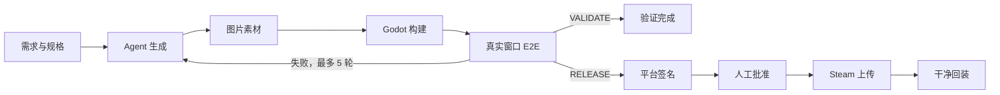
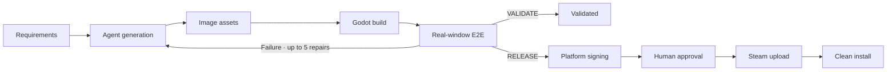
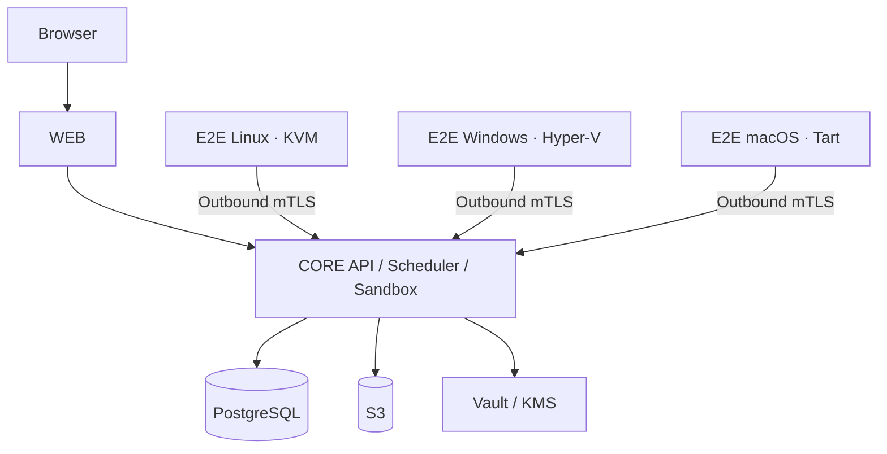

<div align="center">
  
  <h1>DeviLudo</h1>
  <p><strong>AI-native Godot delivery, from requirements to verified game builds</strong></p>
  <p>English by default · 中文在本页切换</p>
  <p>
    <a href="https://github.com/asssaver97/DeviLudo/actions/workflows/ci.yml"></a>
    
    
    
  </p>
</div>

<details name="readme-language">
<summary><strong>简体中文</strong>（点击在本页展开或收起）</summary>

## 项目简介

DeviLudo 把游戏需求、项目源码、AI Agent、图片素材、Godot 构建、真实窗口 E2E 与 Steam 发布连接成一条可追踪的交付流水线。它既能从零生成项目，也能直接在已有本地目录或 Git 工作区中持续迭代。

> [!IMPORTANT]
> 项目当前处于 MVP 阶段。完整本地链路仅支持 Apple Silicon macOS；生产模式需要独立基础设施和 Linux、Windows、macOS E2E 节点。

### 核心能力

| 能力 | 说明 |
| --- | --- |
| AI 开发 | 使用 Claude Code 或 Codex CLI 生成、修改和修复 Godot 项目 |
| 已有项目 | 直接关联本地目录，或使用宿主机 Git 凭证克隆 GitHub 仓库；本地项目不会上传或复制 |
| 多轮迭代 | 按源码 revision 和 workflow iteration 保留规格、任务、制品与测试历史 |
| Git 工作流 | 在项目页创建或切换分支；E2E 成功后自动 commit，但不会自动 push |
| 图片素材 | 根据 Agent 素材清单自动生成，也支持用户文件和占位素材 |
| Godot 构建 | 生成可交付制品，并拦截脚本、导入、启动和导出错误 |
| 真实 E2E | 在一次性图形虚拟机内通过系统级键鼠完成玩家操作并验证状态变化 |
| 可视化证据 | 输出包含 HTML、JSON、日志、真实截图、视觉基线和 diff 的 ZIP |
| Steam 发布 | 平台签名、人工批准、Steam 上传及真实干净回装验证 |

### 交付流程



| 模式 | 终点 |
| --- | --- |
| `VALIDATE` | Agent → 素材 → 构建 → 目标平台 E2E |
| `RELEASE` | Agent → 素材 → 构建 → 三平台 E2E → 签名 → 批准 → Steam → 干净回装 |

每轮开发都是独立工作流。完成、失败或取消后可以创建下一轮，继承规格和源码绑定，同时永久保留上一轮的任务、制品与测试证据。

### 本地快速开始

| 项目 | 要求 |
| --- | --- |
| 系统 | Apple Silicon macOS |
| 运行时 | Node.js 22、Docker/Colima、Homebrew |
| 虚拟化 | Tart；首次启动会准备 macOS E2E 金镜像 |
| 磁盘 | 建议至少 35 GiB 可用空间 |

```bash
git clone https://github.com/asssaver97/DeviLudo.git
cd DeviLudo
npm ci
npm run local:bootstrap
npm run local:up
```

打开 [http://127.0.0.1:3100](http://127.0.0.1:3100)，然后在设置页配置 Claude Code 或 Codex CLI Provider。图片生成 Provider 为可选项。本地默认采用 `standalone` 模式，不需要登录。

首次 `local:up` 会下载约 25 GB 的 macOS 基础镜像并生成版本化 Tart 金镜像。初始化失败时会明确停止，不会降级到宿主机执行。后续启动会复用镜像和初始化状态。需要刷新时运行：

```bash
npm run local:up -- --refresh-e2e-vm
```

基础镜像体积参见 [Tart Quick Start](https://tart.run/quick-start/)。常用命令：

```bash
npm run local:status   # 查看服务状态
npm run local:logs     # 跟踪服务日志
npm run local:down     # 停止服务，保留数据
npm run local:reset    # 停止服务并删除本地数据
```

Agent 默认单任务运行。资源充足时可设置 `DEVILUDO_SANDBOX_CONCURRENCY=2` 并行处理两个任务；允许值仅为 `1` 或 `2`。

### 导入与迭代项目

**本地项目：**选择根目录后，DeviLudo 会立即用目录名创建项目，并在后台分析源码。项目不会经过浏览器上传，也不会复制到其他工作目录。每次 Agent 启动前都会读取原目录最新内容；只有目录基线未被外部修改时，结果才会安全写回原目录。

**GitHub 项目：**DeviLudo 调用宿主机 `git` 克隆仓库，因此可复用 credential helper 或 SSH agent，也不存在浏览器上传的 64 MiB 限制。Git 凭证不会挂载到容器，也不会保存到 DeviLudo。

### 真实操作 E2E

DeviLudo 使用 `deviludo.test-manifest.v3` 将批准规格映射为可执行验证：

1. 从干净用户目录通过操作系统启动最终交付包。
2. 通过只读语义 UI Probe 获取控件位置、可见性、启用状态和游戏进度。
3. 使用 CGEvent、X11 或 SendInput 执行真实点击、拖拽、滚动、键盘和文本输入。
4. 每次玩家操作后验证新的 Probe 序号、状态变化和断言。
5. 在关键检查点截取 `1280×720` 客户区画面，并执行空白检测、区域变化或稳定重放比较。
6. 将需求覆盖、输入步骤、前后状态、日志、PNG 和 diff 打包为 `deviludo.e2e-evidence.v2`。

固定坐标点击、无关按键、程序自报成功、缺少玩家需求覆盖、Godot 脚本错误、空白截图或视觉差异超限都会判定失败。每个平台总预算 30 分钟，产品失败最多自动修复 5 轮；基础设施失败只重试对应节点。

### 生产架构与部署

| 服务器池 | 推荐系统 | 职责 |
| --- | --- | --- |
| `WEB` | Ubuntu 24.04 | Next.js、BFF、唯一公网入口 |
| `CORE` | Ubuntu 24.04 x86_64 | API、调度、Agent、构建和发布 |
| `E2E_LINUX` | Ubuntu 24.04 x86_64 | KVM 图形会话中的 Linux 验证 |
| `E2E_WINDOWS` | Windows 11 Pro x86_64 | Hyper-V 交互会话中的 Windows 验证 |
| `E2E_MACOS` | macOS 15+ Apple Silicon | Tart 图形桌面中的 macOS 验证 |

生产环境还需要 PostgreSQL、S3、Vault/KMS、OpenTelemetry 和负载均衡。公网流量只能进入 `WEB`；E2E 节点只通过出站 mTLS 访问 `CORE`。

推送 `v*` tag 后，[发布工作流](.github/workflows/release.yml)会生成带摘要和 Cosign 签名的镜像及 bundle。填写 [WEB](deploy/web/deploy.env.example)、[CORE](deploy/core/deploy.env.example)、[Linux E2E](deploy/e2e-linux/deploy.env.example)、[Windows E2E](deploy/e2e-windows/deploy.json.example) 和 [macOS E2E](deploy/e2e-macos/deploy.env.example) 配置后，在对应服务器运行：

```bash
sudo ./deploy/<role>/deploy.sh preflight
sudo ./deploy/<role>/deploy.sh bootstrap
sudo ./deploy/<role>/deploy.sh deploy
sudo ./deploy/<role>/deploy.sh status
```

```powershell
.\deploy\e2e-windows\deploy.ps1 -Action preflight
.\deploy\e2e-windows\deploy.ps1 -Action bootstrap
.\deploy\e2e-windows\deploy.ps1 -Action deploy
```

三平台金镜像必须包含 Godot 4.5.1、Node 22、v3 guest runner、对应 GUI driver，以及通过的窗口、输入和截图 smoke。

### 开发、安全与贡献

```bash
npm run check                 # Lint、类型、单元测试、架构和生产构建
npm run local:executor:test   # Agent fixture、Godot 构建和真实 macOS VM E2E
npm run local:database:test   # RLS、并发领取、fencing、恢复和工作流门禁
npm run local:permissions:test
```

- `standalone` 没有登录系统，请勿暴露到不可信网络。
- `platform` 通过外部账号 API 断言会话和成员关系，Core 不保存账号、密码或 OAuth 数据。
- 生产 Agent 在 Kata microVM 中运行；构建和发布容器使用非 root、只读文件系统、资源限制及固定镜像摘要。
- Provider、Steam、数据库和签名凭据不得提交到仓库或写入命令行。

Issue 和 Pull Request 均欢迎。提交前请运行 `npm run check`。相关资料：[架构](docs/architecture.md) · [CI](.github/workflows/ci.yml) · [发布流程](.github/workflows/release.yml)

</details>

<details name="readme-language" open>
<summary><strong>English</strong> (default)</summary>

DeviLudo connects game requirements, source code, AI agents, image assets, Godot builds, real-window E2E, and Steam publishing in one traceable delivery pipeline. It can start a project from scratch or keep iterating directly inside an existing local or Git working tree.

> [!IMPORTANT]
> DeviLudo is currently an MVP. The complete local workflow supports Apple Silicon macOS only. Production requires dedicated infrastructure and Linux, Windows, and macOS E2E nodes.

## Table of contents

- [Highlights](#highlights)
- [Delivery workflow](#delivery-workflow)
- [Quick start](#quick-start)
- [Importing and iterating](#importing-and-iterating)
- [Real-interaction E2E](#real-interaction-e2e)
- [Production architecture](#production-architecture)
- [Development and verification](#development-and-verification)
- [Security](#security)

## Highlights

| Capability | What it provides |
| --- | --- |
| AI development | Generate, modify, and repair Godot projects with Claude Code or Codex CLI |
| Existing projects | Link a local directory directly or clone GitHub with host Git credentials; local projects are never uploaded or copied |
| Iterative delivery | Keep specifications, tasks, artifacts, and test evidence across source revisions and workflow iterations |
| Git workflow | Create or switch branches from the project page; automatically commit after successful E2E without pushing |
| Image assets | Generate from an Agent-authored manifest, accept user-supplied files, or use placeholders |
| Godot builds | Produce delivery artifacts while rejecting script, import, startup, and export errors |
| Real E2E | Exercise player actions with OS-level keyboard and mouse input inside disposable graphical VMs |
| Visual evidence | Package self-contained HTML, JSON, logs, real screenshots, baselines, and diffs in a ZIP |
| Steam delivery | Sign per platform, require human approval, upload to Steam, and verify a real clean installation |
| Operations | PostgreSQL/S3/source backup, mTLS, RLS, observability, and restricted task execution |

## Delivery workflow



| Profile | Endpoint |
| --- | --- |
| `VALIDATE` | Agent → assets → build → target-platform E2E |
| `RELEASE` | Agent → assets → build → three-platform E2E → signing → approval → Steam → clean install |

Every development round is a separate workflow. After completion, failure, or cancellation, the next iteration inherits the specification and source binding while preserving all tasks, artifacts, and evidence from earlier rounds.

## Quick start

### Requirements

| Item | Requirement |
| --- | --- |
| Host | Apple Silicon macOS |
| Runtime | Node.js 22, Docker/Colima, Homebrew |
| Virtualization | Tart; the first startup prepares a macOS E2E golden image |
| Disk | At least 35 GiB free is recommended |

```bash
git clone https://github.com/asssaver97/DeviLudo.git
cd DeviLudo
npm ci
npm run local:bootstrap
npm run local:up
```

Open [http://127.0.0.1:3100](http://127.0.0.1:3100), then configure a Claude Code or Codex CLI provider in Settings. An image-generation provider is optional. Local installations use `standalone` mode and require no account.

The first `local:up` downloads a roughly 25 GB macOS base image and creates a versioned Tart golden image. Initialization fails explicitly instead of falling back to host execution. Later starts reuse the image and bootstrap state. Refresh it explicitly with:

```bash
npm run local:up -- --refresh-e2e-vm
```

See [Tart Quick Start](https://tart.run/quick-start/) for the base-image size note.

### Common commands

```bash
npm run local:status   # Show service status
npm run local:logs     # Follow service logs
npm run local:down     # Stop services and keep data
npm run local:reset    # Stop services and delete local data
```

The Agent processes one task at a time by default. On a larger machine, set `DEVILUDO_SANDBOX_CONCURRENCY=2` to run two tasks concurrently. Only `1` and `2` are accepted.

## Importing and iterating

### Local projects

Selecting a project root immediately creates a project named after that directory while analysis continues in the background. Nothing is uploaded through the browser or copied into a second working directory. Before every Agent run, DeviLudo reads the latest content from the original directory and writes changes back only when its baseline has not been modified externally.

### GitHub projects

DeviLudo invokes the host `git` command, so existing credential helpers and SSH agents continue to work and there is no browser-upload size limit. Git credentials are never mounted into containers or stored by DeviLudo.

## Real-interaction E2E

`deviludo.test-manifest.v3` maps approved specifications to executable verification:

1. Start the final delivery package through the operating system from a clean user profile.
2. Read control bounds, visibility, enabled state, and game progress through a read-only semantic UI probe.
3. Perform real clicks, drags, scrolling, keyboard input, and text entry through CGEvent, X11, or SendInput.
4. Require a new probe sequence, state change, and postcondition after every player action.
5. Capture the `1280×720` client area at key checkpoints and perform blank-image checks, region-change checks, or stable-replay comparison.
6. Package requirement coverage, input steps, before/after state, logs, PNGs, and diffs as `deviludo.e2e-evidence.v2`.

Fixed-coordinate clicks, unrelated keys, self-reported success, missing player coverage, Godot script errors, blank screenshots, and excessive visual differences all fail the run. Each platform has a 30-minute budget. Product failures receive at most five automatic repair rounds; infrastructure failures retry only the affected node.

## Production architecture



| Pool | Recommended OS | Responsibility |
| --- | --- | --- |
| `WEB` | Ubuntu 24.04 | Next.js, BFF, and the only public entry point |
| `CORE` | Ubuntu 24.04 x86_64 | API, scheduling, Agent, builds, and publishing |
| `E2E_LINUX` | Ubuntu 24.04 x86_64 | Linux validation in a KVM graphical session |
| `E2E_WINDOWS` | Windows 11 Pro x86_64 | Windows validation in a Hyper-V interactive session |
| `E2E_MACOS` | macOS 15+ Apple Silicon | macOS validation on a Tart graphical desktop |

Production also requires PostgreSQL, S3, Vault/KMS, OpenTelemetry, and load balancing. Public traffic may enter only `WEB`; E2E nodes reach `CORE` only through outbound mTLS.

### Deployment

1. Push a `v*` tag. The [release workflow](.github/workflows/release.yml) creates digest-pinned, Cosign-signed images and bundles.
2. Complete the matching configuration: [WEB](deploy/web/deploy.env.example), [CORE](deploy/core/deploy.env.example), [Linux E2E](deploy/e2e-linux/deploy.env.example), [Windows E2E](deploy/e2e-windows/deploy.json.example), and [macOS E2E](deploy/e2e-macos/deploy.env.example).
3. Provide database, object storage, Vault, TLS, signing, Steam, and signed golden-image credentials.
4. Run `preflight`, `bootstrap`, `deploy`, and `status` on every server.

```bash
sudo ./deploy/<role>/deploy.sh preflight
sudo ./deploy/<role>/deploy.sh bootstrap
sudo ./deploy/<role>/deploy.sh deploy
sudo ./deploy/<role>/deploy.sh status
```

```powershell
.\deploy\e2e-windows\deploy.ps1 -Action preflight
.\deploy\e2e-windows\deploy.ps1 -Action bootstrap
.\deploy\e2e-windows\deploy.ps1 -Action deploy
```

Every platform golden image must contain Godot 4.5.1, Node 22, the v3 guest runner, its GUI driver, and a passing window/input/screenshot smoke. See the [architecture guide](docs/architecture.md) for more detail.

## Development and verification

```bash
npm run check                 # Lint, types, unit tests, architecture, production build
npm run local:executor:test   # Fixture Agent, Godot build, and real macOS VM E2E
npm run local:database:test   # RLS, concurrent claims, fencing, recovery, workflow gates
npm run local:permissions:test
```

The real-provider smoke test may incur charges and runs only when explicitly started with `npm run local:test`.

## Security

- `standalone` has no login system. Never expose it to an untrusted network.
- `platform` asserts sessions and membership through an external account API. Core does not store accounts, passwords, or OAuth data.
- Production Agents run in Kata microVMs. Build and publishing containers use non-root users, read-only filesystems, resource limits, and pinned image digests.
- Provider, Steam, database, and signing credentials must never be committed or placed on command lines.

## Contributing

Issues and pull requests are welcome. Before submitting a change, run:

```bash
npm run check
```

Further reading: [Architecture](docs/architecture.md) · [CI](.github/workflows/ci.yml) · [Release workflow](.github/workflows/release.yml)

</details>
