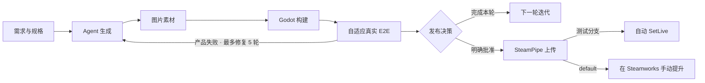
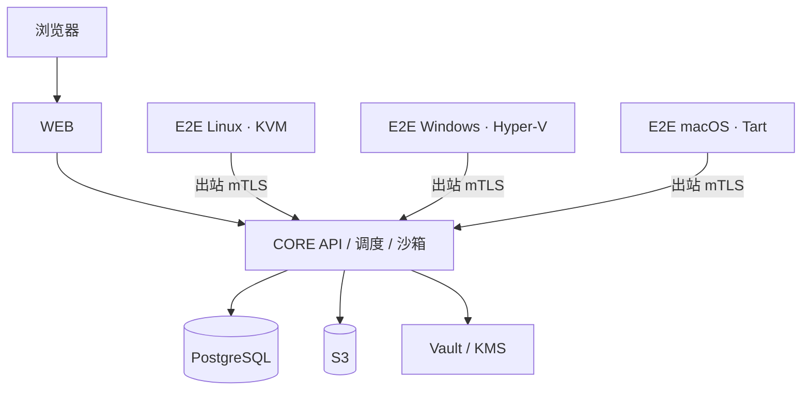

<div align="center">
  
  <h1>DeviLudo</h1>
  <p><strong>面向 Godot 的自建 AI 游戏开发自动化链路</strong></p>
  <p>
    <a href="./README.md">English</a>
    ·
    <strong>简体中文</strong>
  </p>
  <p>
    <a href="https://github.com/asssaver97/DeviLudo/actions/workflows/ci.yml"></a>
    
    
    
    
  </p>
</div>

DeviLudo 是一条自建自动化链路，将需求、源码、专业 AI Agent、图片素材、Godot 构建、真实玩家操作 E2E 和 Steam 交付连接起来。项目不包含托管账号、组织成员、OAuth 或 SaaS 控制面。

> [!IMPORTANT]
> DeviLudo 当前处于 MVP 阶段。完整本地流程仅支持 Apple Silicon macOS；生产模式需要独立 Core 基础设施和 Linux、Windows、macOS E2E 节点。

## 核心能力

| 能力 | 说明 |
| --- | --- |
| 多 Agent 协作 | 设计、开发、测试 Agent 使用独立模型与职责，在持久化项目群聊中共同工作 |
| 已有项目 | 直接修改选择的本地目录，或使用宿主机 Git 凭证克隆 GitHub；不经过浏览器上传，也没有源码大小上限 |
| 多轮迭代 | 每轮开发使用独立工作流，同时保留之前的任务、制品和测试证据 |
| Git 工作流 | 在项目页查看当前分支、创建并切换分支；E2E 成功后自动 commit，但不会自动 push |
| 图片素材 | 根据 Agent 素材计划生成图片，也支持用户素材或明确使用占位图 |
| Godot 构建 | 生成游戏制品，并拦截脚本、导入、启动和导出错误 |
| 自适应真实 E2E | 通过系统级键盘、鼠标和虚拟手柄执行确定性旅程及三次 Test Agent 自适应游玩 |
| 证据与回归 | 保存 HTML、JSON、日志、截图、视频、操作轨迹、视觉 diff，以及每个目标系统唯一的当前回归轨迹 |
| Steam 交付 | 工作区管理凭证，项目管理 App/Depot 配置，并跨迭代保留发布历史 |

项目群聊按设计 → 开发 → 测试的顺序运行。设计 Agent 维护玩法规格和项目说明，开发 Agent 评审实现并生成代码，测试 Agent 负责验收覆盖与回归风险。只有明确的开发指令才会批准并启动交付流程。

## 交付流程



每轮开发都有独立 workflow instance。完成、失败或取消后，可以用最新规格和源码绑定创建下一轮；上一轮保持不可变并可随时查看。

## 本地快速开始

### 本地部署环境要求

| 项目 | 要求 |
| --- | --- |
| 主机 | Apple Silicon Mac（M1 或更新）和 macOS 15 或更新版本；本地一体化流程不支持 Intel Mac 或非 macOS 主机 |
| 工具链 | 与当前系统兼容的最新版 Xcode Command Line Tools（包含 `swiftc`）、Homebrew、Git、Node.js `>=22.13` 和 npm |
| 容器 | Docker Desktop，或 Colima + Docker Compose v2；bootstrap 默认给 Colima 分配 4 CPU、8 GiB 内存和 60 GiB 稀疏磁盘 |
| 虚拟化 | Apple Virtualization Framework 已启用（`sysctl -n kern.hv_support` 返回 `1`）；Tart 会运行 6 GiB 内存的 macOS Tahoe 26 虚拟机 |
| 内存 | 主机至少 16 GiB；Docker 与 E2E 虚拟机同时运行时建议 24 GiB 或更多 |
| 磁盘 | 首次完整启动前建议有 140 GiB 可用空间；Tart 当前会保留约 90–95 GiB，Docker、构建、源码和证据数据还会占用额外空间 |
| 网络 | 能通过 HTTPS 访问 GitHub/GHCR、Homebrew、npm、容器镜像仓库和已配置的 AI Provider |
| 本地端口 | 回环地址上的 `3100`（Web）、`8080`（Core）、`3199`（本地项目桥接）和 `39000`（对象存储）未被占用 |

```bash
git clone https://github.com/asssaver97/DeviLudo.git
cd DeviLudo
npm ci
npm run local:bootstrap
npm run local:up
```

打开 [http://127.0.0.1:3100](http://127.0.0.1:3100)，然后在“设置 → Agent 设置”中选择 Claude Code 或宿主机已用官方账号登录的 Codex CLI。图片生成后端会自动跟随运行时：Codex 使用内置 ImageGen（`gpt-image-2`），Claude 使用当前连接兼容的 Images API 和一个显式图片模型；不再单独设置图片 Provider 或凭据。DeviLudo 始终自建运行，没有产品登录。

`local:bootstrap` 会安装缺失的容器工具链。在 Homebrew 安装 Tart 前，请确保 Xcode Command Line Tools 已更新到与当前系统兼容的版本。首次运行 `local:up` 会产生约 25 GB 网络下载，之后保留 OCI 缓存、基础克隆和带指纹的金镜像。Tart 当前实际占用约 90–95 GiB，Docker 镜像和构建缓存另计。脚本中的 35 GiB 检查只是下载基础镜像前的门槛，不是完整本地占用要求。

初始化失败会明确停止，不会降级到宿主机执行。仅在需要时刷新镜像：

```bash
npm run local:up -- --refresh-e2e-vm
```

常用命令：

```bash
npm run local:status   # 查看服务状态
npm run local:logs     # 跟踪服务日志
npm run local:down     # 停止服务并保留数据
npm run local:reset    # 停止服务并删除本地数据
```

Agent 默认只并发执行一个任务。内存与 Provider 容量充足时可以设置 `DEVILUDO_SANDBOX_CONCURRENCY=2`；仅允许 `1` 或 `2`。

### 从旧托管控制面数据结构升级

本版本会彻底删除账号、成员关系、OAuth 连接、仓库同步及其数据库对象，不保留这套废弃模型的兼容层。如果 `local:up` 提示数据基线不兼容，请先备份需要的数据，再运行 `npm run local:reset:self-hosted`。该命令会删除 DeviLudo 的 PostgreSQL 数据、对象存储制品、内部托管的项目源码目录和 Vault 数据；只与 DeviLudo 关联的外部本地目录不会被删除，远端仓库也不会被删除。

### 远程 E2E 节点

E2E 节点主动向 Core 发起出站连接，Core 不需要反向访问节点。可信局域网/VPN 内的 Windows 机器可按以下步骤加入本地工作区：

1. 显式开放私网接口：`npm run local:up -- --remote-e2e 192.168.1.20`。该地址必须是 Mac 自身的 RFC 1918 或 CGNAT/VPN 私网 IPv4。Web 和本地项目目录桥接仍只监听回环地址，仅开放 Core `8080` 与制品存储 `39000`。
2. 打开“运行状态”，在 `E2E_WINDOWS` 中创建 30 分钟有效的一次性配对码。将它保存到 Windows 文件中，不要放到命令行参数。
3. Windows 11 Pro 启用 Hyper-V，检出与 Core 相同的 DeviLudo revision 并运行 `npm ci`；准备只包含一个导出 Hyper-V VM（`.vmcx`）及其磁盘的 ZIP。Guest 中必须安装 DeviLudo guest runner、GUI/输入驱动、Godot，并配置可登录的图形桌面账号。
4. 在 Windows 宿主机导出该 Guest 账号凭证，然后配对并运行节点：

```powershell
Get-Credential | Export-Clixml C:\DeviludoInput\guest-credential.xml
powershell -ExecutionPolicy Bypass -File scripts\local-remote-windows-e2e.ps1 -Action enroll `
  -CoreUrl http://192.168.1.20:8080 `
  -EnrollmentTokenFile C:\DeviludoInput\enrollment.token `
  -GoldenVmArchive D:\DeviludoImages\windows-golden.zip `
  -GuestCredentialFile C:\DeviludoInput\guest-credential.xml
powershell -ExecutionPolicy Bypass -File scripts\local-remote-windows-e2e.ps1 -Action run
```

本地远程模式只允许可信私网；一次性配对完成后会签发独立、持久且绑定到该节点的凭证，并拒绝公网 IP。公网接入必须使用签名 Release 中的 Core 和 Windows 部署包：Core 通过 TLS `8443` 提供接口，节点能访问制品 URL，节点公网出口 IP 加入 `DEVILUDO_CORE_ALLOWED_CIDRS`；配对、续签和任务通信使用一次性配对码与 mTLS。Windows 节点无需开放任何入站端口。

## 已有项目与持续迭代

### 本地目录

选择项目根目录后，DeviLudo 会立即按目录名创建项目，并在后台异步分析源码。浏览器不会上传项目，也不会将项目复制到第二个工作目录。每次 Agent 运行前都会读取原目录最新内容，只有记录的基线未被外部修改时才会安全写回。

删除 DeviLudo 项目时默认保留绑定目录。确认框提供明确选项，可同时永久删除该本地目录。

### GitHub 仓库

DeviLudo 调用宿主机 `git`，因此公有和私有仓库都能继续使用 credential helper 或 SSH agent。Git 凭证不会挂载到任务容器，也不会保存到 DeviLudo。新建分支在已有项目的紧凑分支控件中完成，而不是在导入时选择。

## 自适应真实操作 E2E

DeviLudo 始终只维护一套当前 E2E 实现和一个当前测试契约 `deviludo.test-manifest`：

1. 从干净用户目录通过操作系统启动最终交付包。
2. 完整执行确定性检查和真实输入旅程；声明支持手柄的游戏必须通过系统级虚拟手柄测试。
3. 每个目标平台使用稳定种子独立运行三次 Test Agent 游玩，至少两次必须由只读 Probe Oracle 证明完成核心循环。
4. Test Agent 只接收降采样游戏画面、批准的玩家目标、允许动作和最近六次可见结果，不接收 Probe、日志、凭证或内部状态。
5. 检测视觉/状态停滞和重复动作循环，只允许一次恢复；仍无进展则失败。
6. 将最短成功轨迹映射到语义控件，并在两个干净目录中连续回放成功后，替换该目标系统的当前回归轨迹。

所有确定性旅程和自适应游玩都会录制 `1280×720`、5 FPS H.264 视频。证据 ZIP 包含自包含 HTML 报告、结构化结果、日志、截图、视频、JSONL 操作轨迹、Oracle 判定、视觉 diff、文件摘要和当前回归摘要。

系统级手柄后端固定为 macOS Core HID、Linux `uinput`、Windows KMDF/VHF。每个金镜像在领取任务前都必须通过真实 Godot 窗口、输入和截图 smoke。固定坐标回归、程序自报成功、玩家需求覆盖不完整、Godot 错误、空白截图、输入卡死或三次游玩不足两次成功都会判定失败。

Apple 仅允许带获批签名 entitlement 的程序创建 Core HID 虚拟设备。本地初始化会在不削弱 macOS 安全机制的前提下检测该能力：键鼠 E2E 仍可用；如果项目声明 `GAMEPAD`，而 E2E 镜像没有 Apple 批准的虚拟 HID 驱动，则会明确报告基础设施不可用。

## Steam 配置

- 在“设置 → Steam 构建凭证”中保存 Steamworks 构建凭证。
- 在项目的“Steam 交付”面板中保存 App ID、各目标系统 Depot ID 和测试分支。
- 凭证正文只存在于本地 Secret Store 或生产 Vault；App/Depot ID 属于项目数据，不使用部署环境变量。
- SteamPipe 可以自动将测试分支设为在线；提升到 `default` 仍需 Steamworks 管理员明确操作。

## 自建多节点架构



| 服务器池 | 推荐系统 | 职责 |
| --- | --- | --- |
| `WEB` | Ubuntu 24.04 | Next.js、BFF 和唯一公网入口 |
| `CORE` | Ubuntu 24.04 x86_64 | API、调度、Agent、构建、证据与 Steam 交付 |
| `E2E_LINUX` | Ubuntu 24.04 x86_64 | KVM 图形会话中的 Linux 验证 |
| `E2E_WINDOWS` | Windows 11 Pro x86_64 | Hyper-V 交互会话中的 Windows 验证 |
| `E2E_MACOS` | macOS Tahoe 26 Apple Silicon | Tart 图形桌面中的 macOS 验证 |

多节点自建环境还需要 PostgreSQL、兼容 S3 的对象存储、Vault/KMS、OpenTelemetry、TLS 和负载均衡。浏览器流量只能进入 `WEB`；E2E 节点通过专用 Core E2E 接口建立出站 mTLS，可运行在局域网、站点 VPN 或带严格来源 CIDR 白名单的公网。

## 匿名使用统计

DeviLudo 最多每 20 小时发送一次尽力而为的活跃安装心跳。载荷仅包含随机安装标识、活跃日期、版本、操作系统和 CPU 架构；绝不包含项目名、源码、本地路径、提示词、模型设置、制品、凭证、姓名或邮箱。与任何 HTTPS 请求一样，配置的接收端仍可能依据其自身隐私政策看到来源 IP 等常规传输元数据。

- 只有分发者或运维者配置 `DEVILUDO_TELEMETRY_ENDPOINT` 后，数据才会离开本机。
- 可随时在“设置 → 匿名使用统计”关闭，或设置 `DEVILUDO_TELEMETRY_ENABLED=0`。
- 日活是某个 `activeDay` 的不同安装标识数，月活是最近 30 天出现过的不同安装标识数；统计的是安装实例，不是可识别的自然人。

推送 `v*` tag 后会生成固定摘要且经 Cosign 签名的镜像和部署 bundle。填写对应的 [WEB](deploy/web/deploy.env.example)、[CORE](deploy/core/deploy.env.example)、[Linux E2E](deploy/e2e-linux/deploy.env.example)、[Windows E2E](deploy/e2e-windows/deploy.json.example) 和 [macOS E2E](deploy/e2e-macos/deploy.env.example) 配置，在“运行状态”中创建目标池的一次性配对码，然后在各服务器执行该角色的 `preflight`、`bootstrap`、`deploy` 和 `status`。Windows 金镜像输入是一个经签名的 Hyper-V 导出 ZIP；初始化 Guest 凭证 JSON 包含 `username` 和 `password`，安装时会立即由受限 Windows 服务身份重新加密并删除明文引导文件。

## 开发与验证

```bash
npm run check                 # Lint、类型、单元测试、架构与生产构建
npm run local:executor:test   # Agent fixture、Godot 构建与真实 macOS VM E2E
npm run local:database:test   # RLS、任务领取、fencing、恢复与工作流门禁
npm run local:permissions:test
```

真实 Provider smoke 可能产生费用，仅在明确运行 `npm run local:test` 时执行。

## 安全

- DeviLudo 没有登录或租户边界。请只在可信网络使用 Web UI，或自行在前面部署访问代理。
- 生产 Agent 在 Kata microVM 中运行；构建与发布容器使用非 root 用户、只读文件系统、资源限制和固定镜像摘要。
- Provider、Steam、数据库和签名凭证不得提交到仓库或写入命令行。

## 参与贡献

欢迎提交 Issue 和 Pull Request。提交变更前请运行 `npm run check`。

[CI](.github/workflows/ci.yml) · [发布流程](.github/workflows/release.yml)

## 许可

DeviLudo 采用 [Elastic License 2.0](LICENSE)，属于 **source-available（源码可用）** 软件。个人和工作室可以免费自建、修改，并用于开发和销售商业游戏；分发修改版时需要保留许可并标注修改。禁止将 DeviLudo 的实质性功能包装为面向第三方的托管或管理服务。

由于托管服务限制不符合 Open Source Definition，本仓库不会把 Elastic-2.0 描述为 OSI 认可的开源许可证。你的游戏和项目文件不会被 DeviLudo 重新许可；第三方引擎、模型、素材和 Provider 仍受各自条款约束。
