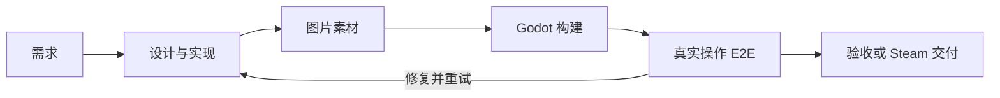

<div align="center">
  
  <h1>DeviLudo</h1>
  <p><strong>面向 Godot 的 AI 游戏开发自动化工具</strong></p>
  <p>
    <a href="./README.md">English</a>
    ·
    <strong>简体中文</strong>
  </p>
  <p>
    <a href="https://github.com/asssaver97/DeviLudo/actions/workflows/ci.yml"></a>
    
    
    
    
  </p>
</div>

DeviLudo 将需求和已有 Godot 项目转化为经过测试的桌面构建与可交付 Steam 的版本。设计、开发和测试 Agent 围绕同一项目协作，生成图片素材、构建游戏、通过系统原生输入操作成品，并为每轮迭代保留完整证据。

> [!IMPORTANT]
> DeviLudo 当前处于 MVP 阶段。完整本地流程需要 Apple Silicon Mac；跨平台生产验证使用独立的 Linux、Windows 和 macOS E2E 节点。

## 核心流程



| 能力 | 作用 |
| --- | --- |
| 专业 Agent | 设计、开发和测试 Agent 分工协作，可分别配置模型 |
| 已有项目接入 | 直接使用本地目录，或通过宿主机 Git 凭证克隆 GitHub 仓库 |
| 持续迭代 | 每轮开发都是独立、可回看的流程，并保留之前的制品与证据 |
| 素材与构建 | 生成图片素材、验证 Godot 项目并产出桌面构建 |
| 真实操作 E2E | 使用系统级键盘、鼠标和虚拟手柄执行确定性旅程与自适应游玩 |
| 交付证据 | 保存报告、日志、截图、视频、操作轨迹和视觉差异 |
| Steam 交付 | 配置 App/Depot、上传 SteamPipe，并保留跨迭代发布记录 |

## 快速开始

### 环境要求

| 项目 | 要求 |
| --- | --- |
| 主机 | Apple Silicon Mac（M1 或更新）和 macOS 15 或更新版本 |
| 工具链 | 最新 Xcode Command Line Tools、Homebrew、Git、Node.js `>=22.13` 和 npm |
| 容器 | Docker Desktop，或 Colima + Docker Compose v2 |
| 虚拟化 | 启用 Apple Virtualization Framework；`sysctl -n kern.hv_support` 必须返回 `1` |
| 资源 | 至少 16 GiB 内存，建议 24 GiB；首次安装前建议预留约 140 GiB 磁盘空间 |
| 网络 | 可通过 HTTPS 访问 GitHub/GHCR、Homebrew、npm、容器镜像仓库和所选 AI Provider |
| 端口 | 回环地址上的 `3100`、`8080`、`3199` 和 `39000` 未被占用 |

### 安装并启动

```bash
git clone https://github.com/asssaver97/DeviLudo.git
cd DeviLudo
npm ci
npm run local:bootstrap
npm run local:up
```

首次启动会下载约 25 GB 数据，并准备容器服务和 macOS E2E 虚拟机。请为虚拟机、镜像、构建缓存、源码与测试证据预留约 140 GiB 空间。

打开 [http://127.0.0.1:3100](http://127.0.0.1:3100)，进入“**设置 → Agent 设置**”，选择以下任一运行时：

- 已在宿主机登录的 Codex CLI；或
- Claude Code，并配置兼容的 Images API 连接和图片模型。

图片生成会自动使用所选 Agent 运行时。

## 使用 DeviLudo

1. 添加本地 Godot 项目目录，或克隆 GitHub 仓库。
2. 在项目群聊中描述功能、改动或游戏目标。
3. 查看设计 Agent 生成的规格，再发送明确的开发指令启动实现。
4. 跟踪构建和 E2E 结果；产品问题最多可返回开发 Agent 修复五轮。
5. 查看证据，然后开始下一轮迭代或批准 Steam 交付。

本地目录项目会原地修改。GitHub 项目沿用宿主机的 credential helper 或 SSH agent。E2E 成功后会在当前分支创建 commit，但不会自动 push。

### E2E 结果

DeviLudo 会从干净的用户目录启动最终交付包，并通过系统原生键盘、鼠标及按需启用的虚拟手柄进行操作。每个目标平台都会执行确定性检查和三次测试 Agent 自适应游玩。

证据包包含独立 HTML 报告、结构化结果、日志、截图、H.264 视频、操作轨迹、Oracle 判定、视觉差异、文件摘要和当前回归摘要。

### Steam 交付

1. 在“**设置 → Steam 构建凭证**”中保存 Steamworks 构建凭证。
2. 在项目的“**Steam 交付**”面板中设置 App ID、各平台 Depot ID 和测试分支。
3. E2E 成功后批准交付。

SteamPipe 可以自动将测试分支设为在线；提升到 `default` 分支仍需 Steamworks 管理员手动完成。

## 常用命令

```bash
npm run local:status   # 查看服务状态
npm run local:logs     # 跟踪服务日志
npm run local:down     # 停止服务并保留数据
npm run local:up       # 再次启动服务
npm run local:reset    # 停止服务并删除 DeviLudo 本地数据
```

仅在需要时刷新 macOS E2E 镜像：

```bash
npm run local:up -- --refresh-e2e-vm
```

Agent 默认只并发执行一个任务。内存和 Provider 容量充足时，可设置 `DEVILUDO_SANDBOX_CONCURRENCY=2` 允许两个并发任务。

## 多节点部署

生产部署将 Web、Core 与 Linux、Windows、macOS E2E 节点分开运行。请填写对应的 [Web](deploy/web/deploy.env.example)、[Core](deploy/core/deploy.env.example)、[Linux E2E](deploy/e2e-linux/deploy.env.example)、[Windows E2E](deploy/e2e-windows/deploy.json.example) 和 [macOS E2E](deploy/e2e-macos/deploy.env.example) 配置。推送 `v*` tag 后会生成发布镜像和部署 bundle。

## 许可

DeviLudo 采用 [Elastic License 2.0](LICENSE)，属于源码可用软件。你的游戏和项目文件继续使用其原有许可。
