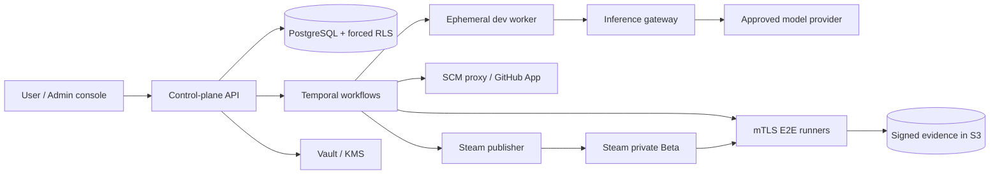

# DeviLudo architecture and trust contracts

## Control and execution planes

DeviLudo separates orchestration from code execution. The TypeScript control
plane owns authorization, immutable revisions, workflow state, audits, GitHub
App operations, and signed job envelopes. Temporal owns durable waits and
retries. PostgreSQL is authoritative; Redis is expendable cache only. Evidence
and builds are content-addressed in S3-compatible storage. Vault/KMS stores
provider credentials and the encrypted Steam `config.vdf` session. OpenTelemetry
propagates `tenant_id`, `project_id`, `workflow_id`, and `run_id`—never prompts,
source text, cookies, or credentials.

There are four isolated execution identities:

1. **Development worker** — an ephemeral Linux microVM containing exactly one
   fixed Claude Code or Codex CLI version. It receives a read-only source
   snapshot plus a writable workspace. It has no GitHub credential and can reach
   inference only through the internal gateway.
2. **SCM proxy** — the sole holder of short-lived GitHub App installation tokens.
   It validates branch/project/commit constraints, creates only work branches
   and Draft PRs, and merges after a signed user-acceptance command.
3. **E2E runner** — Windows, Linux, or macOS with no autonomous Agent installed.
   It accepts signed, fenced jobs and uploads evidence through outbound mTLS.
4. **Steam publisher** — a narrow release identity with no Agent or source-write
   access. It decrypts a build-account Steam session only for a bound release and
   uploads a signed RC to a password-protected Beta branch.

## Immutable decision records

`GameSpecRevision`, `AgentVersion`, `WorkerImage`, `ProviderRevision`,
`AgentProfileRevision`, `AgentRunConfigurationLock`, E2E evidence, and release
manifests are revisioned/content-addressed records. A state change is an
event-sourced snapshot; payloads are never edited in place. Database triggers
make revision and audit tables append-only.

At enqueue, `lockAgentRunConfiguration` dereferences and records all of:

- exact Profile revision, Installation, image digest, CLI version and adapter;
- Provider revision/protocol and exact primary/planning/fast/subagent model IDs;
- CredentialBinding and credential version (never the value);
- permissions, dollar/turn/time budgets, specification and frozen test-plan
  digests, full commit SHA, source digest, and exact target matrix.

Later defaults, rotations, upgrades, or rollbacks affect only new work. A
running task is not resumed under an incompatible CLI. Provider failure yields
`WAITING_PROVIDER`; cross-Agent switching is forbidden. A fallback is considered
only if the current Profile names it, every scope explicitly allows it, it is
active, and it uses the same Agent kind.

## Agent configuration inheritance

Resolution is `project override → tenant override → platform default`, with an
active platform Claude Code Profile as the built-in default. Allow-lists are
intersected; budgets, turns, timeouts, and workspace limits take the minimum;
mandatory protections are logical-OR. Thus a lower scope can constrain but
cannot expand the platform policy.

Only `claude-code` and `codex-cli` are registered in v1. An Agent image contains
one exact CLI and adapter, has a read-only root filesystem, and disables CLI
self-updates. Promotion is `READY → 5% CANARY → 25% rollout checkpoint → 100%
ACTIVE`; failures quarantine the candidate and redirect new tasks to the prior
READY installation. Existing locks continue on their original image.

## Credential and provider boundary

The UI accepts a key only as a write/replace operation. The API writes plaintext
directly to Vault and commits only `SecretRef`, HMAC fingerprint, masked suffix,
and version metadata. A development CLI receives neither the upstream URL nor a
long-lived key. It receives a run-scoped, short-lived token bound to
`tenant + project + run + profile + expiry + budget` and calls the inference
gateway. The gateway retrieves the upstream credential, enforces model and
budget allow-lists, meters usage, and strips sensitive diagnostics.

Provider activation is a separate command from saving a draft. The connector
requires HTTPS, validates every DNS answer and redirect, blocks loopback/private/
link-local/multicast/metadata ranges, pins the resolved destination for the
request, and runs authentication, exact-model, streaming, tool, cancellation,
usage, and timeout probes. Private CAs and private gateways require a
SecurityAdmin-approved connector. A recorded data-region, retention, training
policy, and explicit admin acknowledgement is mandatory before activation.

## Specification, development, and merge

The low-latency idea-chat service produces a new immutable game specification,
acceptance criteria, and fixed test-plan digest. Only an explicit user approval
can schedule development. The selected Agent works on an isolated branch; the
SCM proxy creates a Draft PR. Each feedback submission creates a new immutable
iteration and invalidates all prior candidate evidence. User acceptance permits
merge, after which a full gate reruns against the actual main SHA—candidate PR
evidence can never authorize release.

The idea-chat service has its own mTLS workload boundary and no autonomous tool
runtime. A turn is fenced by its operation key and expected conversation
revision, then atomically appends both messages and complete `GAME_SPEC` /
`TEST_PLAN` draft successors. Approval creates separate `APPROVED` and `FROZEN`
successors plus the append-only `approved_test_plan_bindings` edge; it never
updates a draft revision in place.

The GitHub Connector is repository-scoped by installation ID plus numeric and
GraphQL repository IDs. An Ed25519-attested candidate artifact drives GitHub's
blob/tree/commit/ref APIs; the Agent never pushes. Draft PR creation and merge
are idempotent, lease-claimed external operations. A merge requires a fresh
signed acceptance proof and a database lookup of the exact valid candidate
evidence. If the default branch advances immediately after merge, the receipt
marks `requiresFreshMainSnapshot` instead of reusing the candidate source digest.

Repository selection begins with a hashed single-use GitHub installation state,
transitions through a separate PKCE OAuth state, and uses the resulting
ephemeral GitHub App user token only to verify the current numeric user's access
to the exact installation. A bare setup callback never establishes a tenant
binding.

The production GitHub authorization Broker is a standalone TLS 1.3/mTLS
workload. Authorization intents and its anti-replay request ledger use forced
tenant RLS. The ledger stores request digests and terminal markers but no
response body, because begin/setup redirects contain raw OAuth state. PKCE
verifiers are deposited and consumed once through a separate mTLS Vault facade;
the GitHub OAuth client secret is returned only as a short-lived binary-backed
lease. OAuth codes and ephemeral user tokens never enter PostgreSQL or logs.

Project creation uses a separate TLS 1.3/mTLS repository-onboarding workload.
It accepts only the tenant, signed-in user, verified numeric GitHub user,
installation ID, repository ID, project slug, and display name. The service
re-resolves the user's active installation, obtains a metadata-only installation
token, reads the repository directly from GitHub, and revokes that token. It
then atomically writes the project, derived owner/name/default-branch binding,
and a tenant-RLS idempotency receipt. Browser-supplied repository names or
branches are never authority.

## Runner fencing and evidence

Every selected OS receives a separate lease binding `attempt_id`, platform,
monotonically increasing `fencing_token`, `runner_id`, expiry, `seq_no`, full
commit SHA, source/spec/test-plan digests, and the complete target matrix. Job
payloads are canonicalized and Ed25519-signed. Runner identity is taken only
from an authenticated mTLS peer certificate with one SPIFFE URI SAN; public web
headers and the localhost UI are not runner identity sources.

`acceptPlatformRunnerEvent` is the single platform-stream ingestion gate. It rejects:

- old tokens or expired leases;
- wrong attempt/runner, duplicate or skipped sequence numbers;
- commit or source digest mismatch;
- unselected platforms and events after a terminal event.

A runner may send `PLATFORM_COMPLETED` only after submitting an exact
content-addressed platform manifest. It may never send `ATTEMPT_COMPLETED`.
After all selected platform streams terminate, the control plane derives the
matrix status rather than trusting a runner-supplied aggregate. Evidence
bundles include the signed Godot TestKit digest, production export hashes, logs,
JUnit, deterministic input timelines, screenshots/video, runner capability,
SBOM, scan, and asset-license ledger. The bundle binds one spec, test plan,
commit, source digest, and exact matrix.

## Steam boundary and external approvals

“Accept and publish” requires a fresh MFA assertion. The publisher creates a
signed RC from the verified main SHA, uploads it with a least-privilege Steam
build account to a password-protected Beta, then clean Steam clients install and
run the same platform gate. The platform stores only encrypted `config.vdf`
session material, never the user's master password. Valve review, first-release
action, and default-branch mobile/SMS confirmation transition the workflow to
`EXTERNAL_APPROVAL_REQUIRED`; a verified callback resumes the same Temporal
workflow.

The publisher verifies separate Ed25519 RC and fresh-MFA authorization
envelopes, then claims the upload before any SteamPipe side effect. Its generated
SteamCMD invocation contains the build-account name but no password; an exact-App
`config.vdf` Vault reference is materialized only inside the isolated publisher.
`SetLive` can target only a fixed non-default private branch. The BuildID and all
depot manifest IDs are bound to clean-client attempts for the full selected OS
matrix before external approvals can begin.

## Tenant isolation and authorization

The API authenticates through a GitHub App/OAuth flow, authorizes a tenant and
project before opening a database transaction, and executes `SET LOCAL
app.tenant_id = ...`. Forced PostgreSQL RLS applies to all tenant tables; the
application role is neither owner nor `BYPASSRLS`. `PlatformAgentAdmin`,
`SecurityAdmin`, `TenantAdmin`, `ProjectOwner`, and `Auditor` permissions are
checked at the command boundary. Optimistic versions and tenant-scoped
idempotency keys guard all mutations.

Global registries and public version metadata are kept outside tenant-write
paths. Tenant Provider/Profile revisions cannot reference credentials or
Installations outside their allowed scope. Object keys include a randomized
tenant prefix but access is granted by signed manifests, not path secrecy.

## Operational invariants

- No administrator-provided shell, arbitrary package URL, `curl | sh`, floating
  CLI/model version, or self-update reaches production.
- Autonomous Agents exist only in development workers, never runners or Steam
  publishers.
- A key rotation stops issuance for the old version immediately; already-issued
  tokens retain their short expiry and fixed budget. Revocation denies them too.
- An Installation or revision referenced by a run/default is drained or
  superseded, never deleted.
- Audit entries are sanitized, hash-chained, append-only, and exported to an
  independently retained security sink.
- Temporal activities are idempotent. External side effects carry the workflow
  command ID so retries cannot create duplicate PRs, uploads, or releases.

## Repository map

- `lib/domain`: framework-independent aggregates, policies, transitions, locks,
  runner ingestion, evidence, and audit contracts.
- `services/runner-control`: mTLS workload identity, immutable capabilities,
  Ed25519 job envelopes, per-platform leases and matrix evidence aggregation.
- `db/schema.ts`: D1-backed hosted demo schema.
- `infra/postgres/001_core.sql` through `004_github_verified_identity.sql`:
  production PostgreSQL/RLS, immutable bindings, activity claims, durable jobs,
  approval receipts and verified GitHub identities.
- `infra/docker-compose.yml`: local PostgreSQL, Temporal, Redis, MinIO, Vault,
  and OTel integration stack.
- `infra/vault` and `infra/otel`: least-privilege and telemetry redaction
  starting points.
