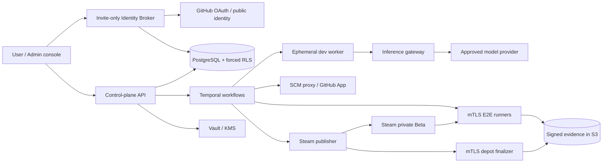

# DeviLudo architecture and trust contracts

## Control and execution planes

DeviLudo separates orchestration from code execution. The TypeScript control
plane owns authorization, immutable revisions, workflow state, audits, GitHub
App operations, and signed job envelopes. Temporal owns durable waits and
retries. PostgreSQL is authoritative; Redis is expendable cache only. Evidence
and builds are content-addressed in S3-compatible storage. Vault/KMS stores
provider credentials and the encrypted Steam `config.vdf` session. OpenTelemetry
propagates W3C trace context across service HTTP calls. Platform code may attach
already-authorized opaque tenant/project/workflow/run identifiers, but never
prompts, source text, URL queries, cookies, authorization headers or credentials.

There are five isolated execution identities:

1. **Development worker** — an ephemeral Linux microVM containing exactly one
   fixed Claude Code or Codex CLI version. It receives a read-only source
   snapshot plus a writable workspace. It has no GitHub credential and can reach
   inference only through the internal gateway.
2. **SCM proxy** — the sole holder of short-lived GitHub App installation tokens.
   It validates branch/project/commit constraints, creates only work branches
   and Draft PRs, and merges after a signed user-acceptance command.
3. **E2E runner** — Windows, Linux, or macOS with no autonomous Agent installed.
   It accepts signed, fenced jobs and uploads evidence through outbound mTLS.
4. **Steam publisher** — a narrow release identity with no Agent or source-write
   access. It decrypts a build-account Steam session only for a bound release,
   accepts only an independently verified signed RC v2, and uploads it to a
   password-protected Beta branch.
5. **Steam depot finalizer** — a separate mTLS release-signing identity. A
   tenant-RLS ledger fences one raw-export operation per release/platform before
   a digest-pinned native controller uses the host keystore/HSM for Authenticode,
   Sigstore or Developer ID plus notarization. It receives and returns content
   addresses only and never exposes a signing credential to the publisher.

## Immutable decision records

`GameSpecRevision`, `AgentVersion`, `WorkerImage`, `ProviderRevision`,
`AgentProfileRevision`, `AgentRunConfigurationLock`, E2E evidence, and release
manifests are revisioned/content-addressed records. A state change is an
event-sourced snapshot; payloads are never edited in place. Database triggers
make revision and audit tables append-only.

At enqueue, `lockAgentRunConfiguration` dereferences and records all of:

- exact Profile revision, Installation, image digest, CLI version and adapter;
- Provider revision/protocol and exact primary/planning/fast/subagent model IDs;
- CredentialBinding and credential version (never the value);
- permissions, dollar/turn/time budgets, specification and frozen test-plan
  digests, full commit SHA, source digest, and exact target matrix.

Later defaults, rotations, upgrades, or rollbacks affect only new work. A
running task is not resumed under an incompatible CLI. Provider failure yields
`WAITING_PROVIDER`; cross-Agent switching is forbidden. A fallback is considered
only if the current Profile names it, every scope explicitly allows it, it is
active, and it uses the same Agent kind.

Recovery does not resolve defaults again. The Provider monitor's mTLS trigger
contains only the waiting action identity; the monitor derives the effective
Provider from the immutable Run and any already-recorded project-scoped
same-Agent failover. It probes through the credential-isolating Inference
Gateway and stores only a digest before a transactionally revalidated workflow
signal is enqueued.

## Agent configuration inheritance

Resolution is `project override → tenant override → platform default`, with an
active platform Claude Code Profile as the built-in default. Allow-lists are
intersected; budgets, turns, timeouts, and workspace limits take the minimum;
mandatory protections are logical-OR. Thus a lower scope can constrain but
cannot expand the platform policy.

A project default may select an active Profile owned by that project, its
tenant, or the platform; a tenant default may select its own or a platform
Profile. The selected Profile keeps its original credential authority, so an
inherited platform Profile does not get rebound to a tenant key. Cross-tenant
and cross-project Profile references fail closed when the immutable Agent run
configuration is resolved.

Only `claude-code` and `codex-cli` are registered in v1. An Agent image contains
one exact CLI and adapter, has a read-only root filesystem, and disables CLI
self-updates. Promotion is `READY → 5% CANARY → 25% rollout checkpoint → 100%
ACTIVE`; failures quarantine the candidate and redirect new tasks to the prior
READY installation. Existing locks continue on their original image.

Fresh `AgentRun` resolution also revalidates the selected AgentVersion's
catalog/validation receipts and exact half-open Adapter compatibility interval,
then embeds that evidence in the immutable configuration lock for both the
primary Profile and an explicitly approved fallback. A digest-valid historical
lock without this field can continue only when PostgreSQL migration 060 marked
the original row as historical, or when the insert trigger proves a repair
descendant has the same Agent/Profile/image/Adapter/Provider/model/budget
identity as a historical predecessor in the same tenant/project. Ordinary new
inserts are forced back to strict mode even if a caller supplies the legacy
flag. The execution Broker independently parses the primary and fallback proof
before it can issue a short-lived inference token or dispatch a microVM; a null
attestation is never upgraded from moving catalog state.

Production queue consumers are placement-scoped rather than tenant-wide. Each
process loads a digest-fixed Worker binding and proves that its Agent, exact CLI,
Adapter and WorkerImage equal the signed Guest rootfs. PostgreSQL derives the
effective placement from the immutable primary Profile or the one append-only
same-Agent Provider failover, then matches the Installation allow-list and
development pool before locking a queue row. This prevents a Claude rootfs from
claiming Codex work and keeps old, canary and active Installation processes from
cross-consuming each other's tasks during rollout.

## Credential and provider boundary

The UI accepts a key only as a write/replace operation. The API writes plaintext
directly to Vault and commits only `SecretRef`, HMAC fingerprint, masked suffix,
and version metadata. A development CLI receives neither the upstream URL nor a
long-lived key. It receives a run-scoped, short-lived token bound to
`tenant + project + run + profile + expiry + budget` and calls the inference
gateway. The gateway retrieves the upstream credential, enforces model and
budget allow-lists, meters usage, and strips sensitive diagnostics.

Provider activation is a separate command from saving a draft. The connector
requires HTTPS, validates every DNS answer and redirect, blocks loopback/private/
link-local/multicast/metadata ranges, pins the resolved destination for the
request, and runs authentication, exact-model, streaming, tool, cancellation,
usage, and timeout probes. Private CAs and private gateways require a
SecurityAdmin-approved connector. A recorded data-region, retention, training
policy, and explicit admin acknowledgement is mandatory before activation.

## Specification, development, and merge

The low-latency idea-chat service produces a new immutable game specification,
acceptance criteria, and fixed test-plan digest. Only an explicit user approval
can schedule development. The selected Agent works on an isolated branch; the
SCM proxy creates a Draft PR. Each feedback submission creates a new immutable
iteration and invalidates all prior candidate evidence. User acceptance permits
merge, after which a full gate reruns against the actual main SHA—candidate PR
evidence can never authorize release.

The idea-chat service has its own mTLS workload boundary and no autonomous tool
runtime. A turn is fenced by its operation key and expected conversation
revision, then atomically appends both messages and complete `GAME_SPEC` /
`TEST_PLAN` draft successors. Approval creates separate `APPROVED` and `FROZEN`
successors plus the append-only `approved_test_plan_bindings` edge; it never
updates a draft revision in place.

Its production model server is a separate non-Agent Broker. Deployment pins an
exact ACTIVE platform Profile and the Broker derives only that Provider's
versioned `smallFastModel`; dialogue and feedback callers cannot submit model,
Base URL, protocol, credential, tool or Vault authority. A prompt-free
tenant-RLS operation ledger is written before upstream dispatch. Completed
strict JSON is replayed, pre-dispatch failures may retry, and an expired or
post-dispatch ambiguous operation becomes `INDETERMINATE` so a potentially
billable request is never repeated silently. The Broker obtains a five-minute
credential lease through its own Secret Broker SPIFFE role and applies the same
public-DNS, CNAME, redirect and TLS pinning policy as the Agent inference path.
Each send has a monotonic dispatch generation. A mutually exclusive
SecurityAdmin reconciliation route may append upstream no-usage or exact-token
evidence for one indeterminate generation; the database trigger releases the
operation only after that matching receipt exists.

The GitHub Connector is repository-scoped by installation ID plus numeric and
GraphQL repository IDs. An Ed25519-attested candidate artifact drives GitHub's
blob/tree/commit/ref APIs; the Agent never pushes. Draft PR creation and merge
are idempotent, lease-claimed external operations. A merge requires a fresh
signed acceptance proof and a database lookup of the exact valid candidate
evidence. If the default branch advances immediately after merge, the receipt
marks `requiresFreshMainSnapshot` instead of reusing the candidate source digest.

Repository selection begins with a hashed single-use GitHub installation state,
transitions through a separate PKCE OAuth state, and uses the resulting
ephemeral GitHub App user token only to verify the current numeric user's access
to the exact installation. A bare setup callback never establishes a tenant
binding.

The production GitHub authorization Broker is a standalone TLS 1.3/mTLS
workload. Authorization intents and its anti-replay request ledger use forced
tenant RLS. The ledger stores request digests and terminal markers but no
response body, because begin/setup redirects contain raw OAuth state. PKCE
verifiers are deposited and consumed once through a separate mTLS Vault facade;
the GitHub OAuth client secret is returned only as a short-lived binary-backed
lease. OAuth codes and ephemeral user tokens never enter PostgreSQL or logs.

Project creation uses a separate TLS 1.3/mTLS repository-onboarding workload.
It accepts only the tenant, signed-in user, verified numeric GitHub user,
installation ID, repository ID, project slug, and display name. The service
re-resolves the user's active installation, obtains a metadata-only installation
token, reads the repository directly from GitHub, and revokes that token. It
then atomically writes the project, derived owner/name/default-branch binding,
and a tenant-RLS idempotency receipt. Browser-supplied repository names or
branches are never authority. Project workspace reads re-check the tenant plus
either the creator subject or the still-active installation's verified GitHub
user before returning metadata. The UI then reads the specification service's
authoritative snapshot; an absent snapshot starts at revision zero rather than
reusing a demo conversation.

That project check is also a mandatory Web precondition for every production
idea turn, specification read or approval, feedback iteration, candidate
acceptance, delivery cancellation, delivery projection, Runner Fleet view and
Evidence Catalog read. A tenant assertion alone never authorizes a project UUID;
revoked installation access stops the request before any downstream Broker is
called.

## Runner fencing and evidence

Every selected OS receives a separate lease binding `attempt_id`, platform,
monotonically increasing `fencing_token`, `runner_id`, expiry, `seq_no`, full
commit SHA, source/spec/test-plan digests, and the complete target matrix. Job
payloads are canonicalized and Ed25519-signed. Runner identity is taken only
from an authenticated mTLS peer certificate with one SPIFFE URI SAN; public web
headers and the localhost UI are not runner identity sources.

Physical Runner machine config v2 does not carry tenant authority. Each host
reloads the same short-lived signed Fleet Manifest used by ingress before every
poll cycle, projects only the tenants bound to its SPIFFE ID, certificate
fingerprint, capability digest and platform, and rejects a registration receipt
whose server-observed mTLS identity differs from that lock.

`acceptPlatformRunnerEvent` is the single platform-stream ingestion gate. It rejects:

- old tokens or expired leases;
- wrong attempt/runner, duplicate or skipped sequence numbers;
- commit or source digest mismatch;
- unselected platforms and events after a terminal event.

A runner may send `PLATFORM_COMPLETED` only after submitting an exact
content-addressed platform manifest. It may never send `ATTEMPT_COMPLETED`.
After all selected platform streams terminate, the control plane derives the
matrix status rather than trusting a runner-supplied aggregate. Evidence
bundles include the signed Godot TestKit digest, production export hashes, logs,
JUnit, deterministic input timelines, screenshots/video, runner capability,
SBOM, scan, and asset-license ledger. The bundle binds one spec, test plan,
commit, source digest, and exact matrix.

Specification approval does not accept a toolchain identifier from the browser
or model. Inside the same tenant-RLS transaction it selects the newest
project-scoped immutable revision whose Godot version and exact export-template
key set match the approved matrix, validates the canonical payload, and freezes
its ID and digest beside the test plan. Missing authority rolls back before the
approved revisions are written. A database trigger repeats the compatibility
check, closing alternate-writer and parser-drift paths.

Those project revisions are produced only by a separate TLS 1.3/mTLS Runner
Toolchain Publisher. Its supply-chain workload is distinct from every physical
Runner and from Web. A publication names exact Runner capability digests and
the TestKit/build/SBOM/scan/license evidence, while the Publisher reloads the
signed Fleet Manifest and derives each export-template digest from the current
immutable Runner registration. PostgreSQL serializes project revisions and
keeps the publication receipt append-only; an insert trigger independently
joins every declared platform back to the ONLINE Runner registration.

## Steam boundary and external approvals

“Accept and publish” requires a fresh MFA assertion. The publisher creates a
signed RC v2 from the verified main SHA. Each depot binds the original Runner
export to a separately verified Linux Sigstore, Windows Authenticode or macOS
Developer ID artifact; macOS also binds mandatory notarization evidence. The
separate finalizer durably claims the tenant/release/platform operation and
invokes only an executable and non-secret signing policy with fixed SHA-256
digests. Signing authority remains in the host keystore/HSM, and its receipt is
insufficient by itself: the publisher independently verifies the finalized
artifact and evidence objects in S3 before RC signing. The
Windows, Linux and macOS finalizers are separate mTLS origins; each advertises
only its local scheme, while the isolated Steam executor probes all three and
routes the immutable target without fallback. The
publisher uploads it with a least-privilege Steam
build account to a password-protected Beta, then clean Steam clients install and
run the same platform gate. The platform stores only encrypted `config.vdf`
session material, never the user's master password. Valve review, first-release
action, and default-branch mobile/SMS confirmation transition the workflow to
`EXTERNAL_APPROVAL_REQUIRED`; a verified callback resumes the same Temporal
workflow.

The release ID is created server-side from passed main-SHA evidence and then
projected through the replay-valid `RELEASE_PREPARED` workflow signal. Only
while that exact release is in `WAITING_MFA` does the project console show the
publish action; the browser sends no commit, evidence, App ID, credential, or
MFA assertion to the Web route.

The publisher verifies separate Ed25519 RC and fresh-MFA authorization
envelopes, then claims the upload before any SteamPipe side effect. Its generated
SteamCMD invocation contains the build-account name but no password; an exact-App
`config.vdf` Vault reference is materialized only inside the isolated publisher.
`SetLive` can target only a fixed non-default private branch. The BuildID and all
depot manifest IDs are bound to clean-client attempts for the full selected OS
matrix before external approvals can begin.

The external approval monitor is a separate Agent-free mTLS boundary. An
allow-listed Steam verifier submits only the exact App ID, tested BuildID,
current gate, verifier approval ID, observation time and digest of its raw Steam
evidence. The monitor re-resolves the waiting action, release, BuildID and passed
clean-install evidence under tenant RLS, rejects stale/future or out-of-order
observations, and records an immutable receipt before enqueueing the Temporal
signal. The public Web process cannot assert Valve review, first-release or
default-branch confirmation.

## Tenant isolation and authorization

The API authenticates through an invite-only GitHub App/OAuth flow. An
administrator creates a random invitation through an admin-only mTLS workload;
only its SHA-256 digest is stored. Login binds the invitation, random OAuth
state, PKCE verifier and an independent HttpOnly browser binding. The callback
revalidates `/user`, revokes the ephemeral GitHub token, atomically consumes the
invitation and creates the user, membership and an eight-hour revocable session.
The raw platform session exists only in a Secure/HttpOnly/SameSite cookie; every
API request exchanges it for a fresh, method-and-path-bound HMAC assertion.
Logout revokes the durable session before clearing both cookies.

The API then authorizes a tenant and project before opening a database transaction, and executes `SET LOCAL
app.tenant_id = ...`. Forced PostgreSQL RLS applies to all tenant tables; the
application role is neither owner nor `BYPASSRLS`. `PlatformAgentAdmin`,
`SecurityAdmin`, `TenantAdmin`, `ProjectOwner`, and `Auditor` permissions are
checked at the command boundary. Optimistic versions and tenant-scoped
idempotency keys guard all mutations.

Global registries and public version metadata are kept outside tenant-write
paths. Tenant Provider/Profile revisions cannot reference credentials or
Installations outside their allowed scope. Object keys include a randomized
tenant prefix but access is granted by signed manifests, not path secrecy.

## Operational invariants

- No administrator-provided shell, arbitrary package URL, `curl | sh`, floating
  CLI/model version, or self-update reaches production.
- Autonomous Agents exist only in development workers, never runners or Steam
  publishers.
- A key rotation stops issuance for the old version immediately; already-issued
  tokens retain their short expiry and fixed budget. Revocation denies them too.
- An Installation or revision referenced by a run/default is drained or
  superseded, never deleted.
- Audit entries are sanitized, hash-chained, append-only, and exported to an
  independently retained security sink.
- Temporal activities are idempotent. External side effects carry the workflow
  command ID so retries cannot create duplicate PRs, uploads, or releases.
- A one-shot migration workload must complete before a new service revision can
  start. It owns a distinct file-mounted database credential, holds a PostgreSQL
  advisory lock, verifies the immutable digest ledger and commits each schema
  change together with its migration record. Production never adopts an
  untracked schema or rewrites historical migration files.
- The shared Linux control-plane image has an exhaustive service classification.
  Its fixed entrypoint admits only non-native control workloads selected through
  `DEVILUDO_SERVICE`; Agent execution, physical E2E, signing, Steam client and
  localhost services remain external workloads. The build requires a
  digest-pinned Node base and source-derived immutable tag, pushes BuildKit
  provenance plus an SBOM, and returns the final registry digest as authority.

## Repository map

- `lib/domain`: framework-independent aggregates, policies, transitions, locks,
  runner ingestion, evidence, and audit contracts.
- `services/runner-control`: mTLS workload identity, immutable capabilities,
  Ed25519 job envelopes, per-platform leases and matrix evidence aggregation.
- `services/identity`: invitation issuance, GitHub OAuth/PKCE, tenant membership,
  revocable platform sessions and route-bound trusted assertions.
- `db/schema.ts`: D1-backed hosted demo schema.
- `infra/postgres/001_core.sql` through `063_agent_microvm_credential_issuances.sql`:
  production PostgreSQL/RLS, immutable bindings, activity claims, durable jobs,
  approval receipts, external authority ledgers and the digest-locked upgrade
  history used by `npm run db:migrate`.
- `infra/docker-compose.yml`: local PostgreSQL, Temporal, Redis, MinIO, Vault,
  and OTel integration stack.
- `Dockerfile.control-plane`, `.dockerignore` and `scripts/production/`: the
  least-authority shared control image, digest-bound build receipt, immutable
  migration runner, three-stage Kubernetes release gate and exhaustive
  production configuration contracts.
- `infra/vault` and `infra/otel`: least-privilege and telemetry redaction
  starting points.
